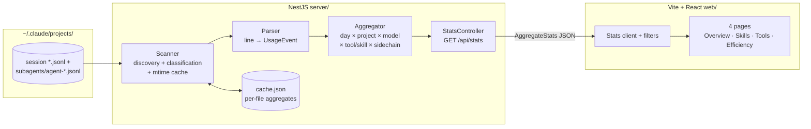

# Claude Code Usage Dashboard Implementation Plan

> **Next step:** Use the `plan-to-task-breakdown` skill to expand each phase below into a detailed, parallelized task execution document before any implementation begins.

**Goal:** A local web dashboard that parses `~/.claude/projects/**/*.jsonl` transcripts and shows skill usage, daily token consumption, and tool-call patterns, so Eric can see how he uses Claude Code and where efficiency is lost.

**Architecture:** A single repo with two packages: a NestJS backend whose stats module scans transcript files (main sessions *and* `subagents/agent-*.jsonl` sidechains), streams them line-by-line into typed usage events, and rolls them up by day × project × model × tool/skill × sidechain; and a Vite + React + Recharts frontend that fetches one aggregate endpoint and filters client-side. Per-file aggregates are cached keyed by (path, mtime, size) so refreshes only re-parse changed sessions. No database — the rolled-up aggregate is small and lives in memory plus a JSON cache file.

**Branch:** feature/DASH-0000-claude-usage-dashboard — carried through task breakdown and execution unchanged

---

## Requirements

### Functional

- Parse every `*.jsonl` transcript under `~/.claude/projects/`, including sidechain transcripts at `<project>/<sessionId>/subagents/agent-*.jsonl`, and extract: per-message token usage (input, output, cache read, cache creation) with model and timestamp; tool_use calls by tool name; `Skill` tool calls by `input.skill`; slash-command invocations from `<command-name>` tags in user messages; tool_result error flags; sidechain identity (`agentId`, plus `agentType` from the adjacent `agent-*.meta.json`).
- Serve a single aggregate over HTTP; the frontend renders four pages: Overview (daily tokens stacked by type with a main-vs-subagent breakdown, sessions/day, tokens by model and project), Skills (counts, trend, per-project — skills and built-in slash commands as separate series), Tools (counts, error rates, per-project), Efficiency (cache hit ratio, tool error rate, avg tokens per session, subagent usage — run counts, agent types, and sidechain token share — most active projects).
- Filter all pages by date range and project, client-side, operating on the aggregator's pre-bucketed local-time day keys.
- Manual refresh re-scans the transcript directory incrementally; refresh is single-flight (a concurrent request joins the in-progress scan rather than starting a second one).

### Non-Functional

- Read-only against `~/.claude` — the dashboard never writes inside it; its own cache lives in the project directory.
- Incremental refresh with ≤10 changed files completes in under 5 seconds; first full scan of ~267MB may take tens of seconds and must log per-batch progress.
- Tolerant of schema drift and live files: unknown line types are counted as `ignoredLines`, JSON parse failures (including a torn final line of a file being actively appended to) as `malformedLines`; a parse failure in one file never aborts the scan; a corrupt or truncated `cache.json` is discarded and rebuilt, never fatal.
- Local, single-user, no auth.

## Assumptions

1. **Transcript line shape** — verified by sampling real files: line-delimited JSON where `type: "assistant"` entries carry `message.usage` (`input_tokens`, `output_tokens`, `cache_read_input_tokens`, `cache_creation_input_tokens`), `message.model`, `timestamp`, and (usually) `requestId`; `tool_use` content blocks carry `name` and `input`; `tool_result` blocks carry `is_error`; user messages embed `<command-name>` for slash commands. Locally-generated entries with `"model":"<synthetic>"` have all-zero usage and no `requestId`.
2. **Two transcript populations** — verified: main session files `<project-dir>/<sessionId>.jsonl`, and sidechain files `<project-dir>/<sessionId>/subagents/agent-<agentId>.jsonl` with `isSidechain: true`, the *parent's* `sessionId`, full per-line `message.usage`, and an adjacent `agent-<agentId>.meta.json` carrying `agentType` and `description`. Sidechain files outnumber main files (299 vs 217 in the current tree).
3. **Node ≥ 20 available** — verified: v24.13.0 on this machine.

## Options Considered

Recorded in the idea doc (`docs/ideas/2026-08-01-claude-usage-dashboard-idea.md`): NestJS + React chosen over Streamlit for stack familiarity and UI control; no database chosen over SQLite because aggregates are small. Not repeated here.

## Architecture

### Flow / Concept Diagram

### Integration Points

- **`~/.claude/projects/`** — read-only file reads; the only external dependency. Path is configurable (env var with this default) so tests point at fixtures.
- **Vite dev proxy** — `/api` proxied to the NestJS port in development; no CORS handling needed.

### Declared data contracts

These two shapes are the registry-ready contracts the whole wave codes against; Phase 1 *implements* them, it does not invent them.

**`UsageEvent`** — discriminated union with variants: `token` (day key, project, model, requestId?, uuid, input/output/cacheRead/cacheCreation token counts, isSidechain, agentId?), `tool-call` (day key, project, tool name, isSidechain), `tool-error` (same keys as tool-call), `skill` (day key, project, name, source: `skill-tool` | `slash-command`), plus per-file counters `malformedLines` and `ignoredLines`.

**`AggregateStats`** — top-level keys, exactly: `generatedAt`, `scannedFiles`, `malformedLines`, `ignoredLines`, `days` (per local-time day: token totals by type, sessions started, sidechain token totals), `projects`, `models`, `tools` (calls + errors), `skills` (with source split), `agents` (per agentType: runs + tokens), `totals`. Adding or removing a top-level key is a contract change.

### Seams

- **Scanner → Parser:** file path, classification (main | sidechain, with agentId/agentType), and a line stream. _Injectable — the parser is a pure function over lines plus classification, testable entirely on fixture strings._
- **Parser → Aggregator:** a stream of typed `UsageEvent`s. _Injectable — the aggregator consumes hand-built event arrays in tests._
- **Aggregator ↔ cache store:** per-file aggregate keyed by (path, mtime, size). _Injectable — an in-memory store stands in for the JSON file._
- **StatsController → frontend:** the `AggregateStats` shape (declared above) over `GET /api/stats`. _Injectable — the frontend builds against a fixture JSON of the declared shape._
- **Wired app end-to-end:** NestJS serving real parsed data to the real frontend. _Not fakeable — proved after the rest lands, against a real transcript sample._

### Key Design Decisions

- **One aggregate endpoint, client-side filtering** — the rolled-up aggregate is kilobytes; per-metric endpoints would be speculative API surface.
- **Per-file aggregate cache, not per-line** — caching each file's aggregate keyed by (path, mtime, size) makes invalidation trivial and correct.
- **Parser reads only known fields and known `type` values** — schema drift degrades to undercounting new event kinds, never crashes; unknown-but-well-formed lines increment `ignoredLines` (known-ignorable types observed in real data: `file-history-snapshot`, `system`, `attachment`, `summary`, `deferred_tools_delta`, `skill_listing`), parse failures increment `malformedLines`, and only `malformedLines` is surfaced as a warning.
- **Cache hit ratio formula** — `cache_read_input_tokens / (input_tokens + cache_read_input_tokens + cache_creation_input_tokens)`, over the filtered range. The nested `cache_creation.ephemeral_*` breakdown is ignored for v1.
- **Model normalization** — strip context-window suffixes (`claude-opus-4-8[1m]` → `claude-opus-4-8`); `<synthetic>` entries are excluded from model charts (they carry zero tokens).

## Risks & Mitigations

| Risk | Impact | Mitigation |
|------|:------:|------------|
| Subagent tokens double-counted (parent `tool_result` rollup carries `totalTokens`/`usage` *and* the sidechain file records the same work) | High | Decision 6: sidechain transcripts are the sole token source; parent-side `tool_result` rollups are never harvested. Locked by the parent+subagent fixture test |
| Sidechain files misattributed to a project named `subagents` or to phantom UUID projects | High | Scanner classification rule (Decision 5): project key = directory directly under `projects/`, session key = `sessionId` field, never path segments below the project dir |
| Transcript schema changes in future Claude Code versions | Med | Known-fields-only parsing; `malformedLines` vs `ignoredLines` split so real drift is visible without false alarms |
| First full scan of 267MB feels hung | Med | Streamed parsing with per-batch progress logging; cache makes it a one-time cost |
| Token double-count from multi-line `requestId` groups (verified: last line carries the complete figure) | Med | Dedupe rule in Decision 7, locked by a shared-`requestId` fixture |
| Concurrent refreshes interleave cache writes | Low | Refresh is single-flight; a second request joins the in-progress scan |
| Cache staleness after in-place rewrite with same size | Low | Key includes mtime, which changes on rewrite; acceptable residual risk |

## Migration

No migration required.

## Testing Strategy

- **Unit:** parser (fixture JSONL lines → expected `UsageEvent`s: malformed lines, ignorable types, MCP tool names, `Skill` inputs, `<command-name>` extraction, `<synthetic>` entries, sidechain classification); aggregator (hand-built events → expected rollups, `requestId` dedupe, day bucketing at a local-midnight boundary); cache store (unchanged file skipped, changed mtime re-parsed, corrupt cache file discarded).
- **Integration:** stats module wired with a fixture transcript directory → `GET /api/stats` returns the declared shape with correct totals.
- **Regression locks** (all against checked-in fixtures with hand-computed expected numbers):
  - The fixture directory contains a parent session plus one `subagents/agent-*.jsonl`; total tokens equal the hand-summed figure counting the subagent's work exactly once — the parent's `tool_result` rollup contributes nothing.
  - A 3-line group sharing one `requestId` (output_tokens 5, 5, 153) contributes exactly 153 output tokens.
  - Daily totals bucket by local time: a fixture message timestamped 23:30 local lands on that local day, not the UTC day.
  - A fixture file with 3 unparseable lines (including a torn final line) yields `malformedLines: 3` and still contributes its valid events; well-formed non-usage lines land in `ignoredLines`, not `malformedLines`.
  - `/api/stats` top-level keys are exactly the set declared in the data contract — an extra or missing key fails the test.
- **Verification beyond tests:** run against the real `~/.claude/projects` and spot-check one local day's token total and one tool count against a manual grep/sum of that day's session files.

## Implementation Phases

### Phase 1: Parsing core

Build the scanner (discovery + main/sidechain classification), parser, and aggregator as plain TypeScript modules (no Nest wiring yet), implementing the declared `UsageEvent` and `AggregateStats` contracts, with the fixture transcripts and unit tests that lock the regression numbers above. Done when fixture-driven unit tests pass and the contract types are exported from one place.

### Phase 2: NestJS API and cache

Stand up the NestJS app with a stats module exposing `GET /api/stats` and a single-flight refresh trigger, wiring the Phase 1 modules behind the injectable cache store and a configurable transcripts path. Coded against the declared contracts, so it proceeds in parallel with a stand-in aggregator. Done when the integration test serves correct totals from the fixture directory.

### Phase 3: Frontend

Scaffold the Vite + React app with the four pages, Recharts visualizations, and date-range/project filters, built against a fixture `AggregateStats` JSON matching the declared contract. Skills-page charts must handle sparse data gracefully (~250 total skill/command invocations exist today — bin by week, not day). Done when all four pages render the fixture data correctly with filters applied client-side.

### Phase 4: Wire and verify end to end

Connect the dev proxy, run the real server against real transcripts, and perform the manual spot-checks from Testing Strategy. This phase asserts against the wired application with real data, so it cannot be stood in for and runs after the rest lands. Done when the dashboard renders Eric's actual history and one local day's totals match a manual sum.

## Decisions

1. **Backend framework** — NestJS. Chosen over Fastify/Express (my recommendation) because Eric knows NestJS; module overhead is negligible at this size. _Decided by Eric, 2026-08-01._
2. **Web interface** — full web app rather than static generated HTML or CLI report. _Decided by Eric, 2026-08-01._
3. **Frontend stack** — Vite + React + Recharts, no UI framework. Chosen over Next.js because no SSR/routing complexity is needed. _Decided by Eric (accepting recommendation), 2026-08-01._
4. **No database** — in-memory aggregate plus JSON cache file. Chosen over SQLite because rolled-up data is kilobytes. _Decided in brainstorming, 2026-08-01._
5. **Sidechain handling** — sidechain transcripts (`<project>/<sessionId>/subagents/agent-*.jsonl`) are scanned and fully attributed: project key is the directory directly under `projects/` (walking up past `subagents/` and the session dir), session key is the `sessionId` field (never the filename), and sidechain tokens are included in Overview totals with an explicit main-vs-subagent breakdown, plus per-agent-type detail on the Efficiency page. Chosen over ignoring sidechains because they outnumber main sessions and hold a large token share, and Eric wants to understand subagent behavior specifically. _Decided by Eric, 2026-08-01 (review surfaced the data)._
6. **Single source of truth for subagent tokens** — the sidechain transcript files. Parent-side `Agent` `tool_result` rollups (`totalTokens`, embedded `usage`) are never harvested, because harvesting both counts the same work twice. Chosen over parent-rollup-only because sidechain files carry per-line model/timestamp detail the rollup lacks. _Decided by review finding, 2026-08-01._
7. **Token dedupe rule** — per-file scope (cross-file dedupe is unnecessary — verified requestIds do not repeat across files — and the per-file cache makes it structurally impossible anyway); key is `requestId`, falling back to the line `uuid` when absent; keep the *last* usage-bearing occurrence in file order (verified: interim lines carry partial output counts, the last carries the complete figure). _Decided by review finding, 2026-08-01._
8. **Day bucketing** — local time (`Asia/Hong_Kong` machine locale), applied once in the aggregator; the frontend filters on pre-bucketed day keys and never re-derives days from timestamps. Chosen over UTC because a personal dashboard should match the user's working day. _Decided 2026-08-01._
9. **Skills vs built-in commands** — `<command-name>` invocations are kept as a separate series from `Skill` tool calls (source field: `slash-command` vs `skill-tool`), because built-ins like `/context` and `/fast` are not skills and would pollute a merged ranking. Verified no double-counting: user-typed slash commands do not also emit a `Skill` tool_use. _Revised from the earlier merged-dimension decision after review, 2026-08-01._

## Open Questions

1. **[NEEDS REVIEW] OQ-1 — cost estimation.** Show estimated dollar cost (model pricing × tokens) on the Overview page, or tokens only? *Affects Phase 3 only — if added, the pricing map is a frontend-side table keyed on normalized model names; no Phase 1 change.* Note the transcripts carry internal model codenames (`claude-opus-4-8`), so any pricing map is best-effort. Default: no for v1. Eric owns this.

## Success Criteria

- [ ] Dashboard renders all four pages from Eric's real transcript history with date-range and project filters working.
- [ ] For one checked local day, dashboard token totals match a manual sum over that day's session and sidechain files, with subagent work counted exactly once; one tool count matches a manual grep.
- [ ] Incremental refresh with ≤10 changed files completes in under 5 seconds.
- [ ] A malformed or future-format transcript file never crashes the scan; parse failures and ignored line types are counted separately.

## References

- `docs/ideas/2026-08-01-claude-usage-dashboard-idea.md` — validated idea and stack decision record
- `~/.claude/projects/**/*.jsonl` — data source; field shapes verified 2026-08-01 by sampling, then adversarially re-verified in plan review (sidechain population, rollup double-count vector, requestId grouping)
