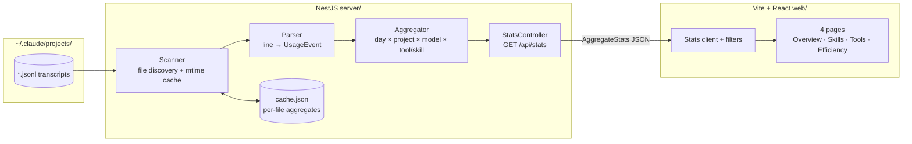

# Claude Code Usage Dashboard Implementation Plan

> **Next step:** Use the `plan-to-task-breakdown` skill to expand each phase below into a detailed, parallelized task execution document before any implementation begins.

**Goal:** A local web dashboard that parses `~/.claude/projects/**/*.jsonl` transcripts and shows skill usage, daily token consumption, and tool-call patterns, so Eric can see how he uses Claude Code and where efficiency is lost.

**Architecture:** A single repo with two packages: a NestJS backend whose stats module scans transcript files, streams them line-by-line into typed usage events, and rolls them up by day × project × model × tool/skill; and a Vite + React + Recharts frontend that fetches one aggregate endpoint and filters client-side. Per-file aggregates are cached keyed by (path, mtime, size) so refreshes only re-parse changed sessions. No database — the rolled-up aggregate is small and lives in memory plus a JSON cache file.

**Branch:** feature/DASH-0000-claude-usage-dashboard — carried through task breakdown and execution unchanged

---

## Requirements

### Functional

- Parse every `*.jsonl` transcript under `~/.claude/projects/` and extract: per-message token usage (input, output, cache read, cache creation) with model and timestamp; tool_use calls by tool name; `Skill` tool calls by `input.skill`; slash-command invocations from `<command-name>` tags in user messages; tool_result error flags.
- Serve a single aggregate over HTTP; the frontend renders four pages: Overview (daily tokens stacked by type, sessions/day, tokens by model and project), Skills (counts, trend, per-project), Tools (counts, error rates, per-project), Efficiency (cache hit ratio, tool error rate, avg tokens per session, subagent usage via `Agent` tool calls, most active projects).
- Filter all pages by date range and project, client-side.
- Manual refresh re-scans the transcript directory incrementally.

### Non-Functional

- Read-only against `~/.claude` — the dashboard never writes inside it; its own cache lives in the project directory.
- Incremental refresh completes in a few seconds when only a handful of files changed; first full scan of ~267MB may take tens of seconds and must show progress or at least not hang the UI.
- Tolerant of schema drift across Claude Code versions: unknown line types and unknown fields are ignored, malformed lines are skipped and counted, and a parse failure in one file never aborts the scan.
- Local, single-user, no auth.

## Assumptions

1. **Transcript location and shape** — verified by sampling real files: line-delimited JSON where `type: "assistant"` entries carry `message.usage` (`input_tokens`, `output_tokens`, `cache_read_input_tokens`, `cache_creation_input_tokens`), `message.model`, and `timestamp`; `tool_use` content blocks carry `name` and `input`; `tool_result` blocks carry `is_error`; user messages embed `<command-name>` for slash commands. Safe to build on.
2. **Project attribution** — the transcript's parent directory name (e.g. `-Users-eric-dash-hail-backend`) and the `cwd` field both identify the project; directory name is stable per file and is the primary key, with `cwd` as display label. Verified in samples.
3. **Session identity** — one `.jsonl` file ≈ one session (`sessionId` is constant within a file in samples). Sessions/day counts a file on the day of its first timestamped message.
4. **Subagent usage** is measurable from `Agent` tool_use counts. The `isSidechain` flag was 0 across sampled files, so per-subagent token attribution is *not* assumed available (see OQ-2).
5. **Node ≥ 20 and npm are available locally** — Eric's other projects are Node-based; not re-verified on this machine.

## Options Considered

Recorded in the idea doc (`docs/ideas/2026-08-01-claude-usage-dashboard-idea.md`): NestJS + React chosen over Streamlit for stack familiarity and UI control; no database chosen over SQLite because aggregates are small. Not repeated here.

## Architecture

### Flow / Concept Diagram

### Integration Points

- **`~/.claude/projects/`** — read-only file reads; the only external dependency. Path is configurable (env var with this default) so tests point at fixtures.
- **Vite dev proxy** — `/api` proxied to the NestJS port in development; no CORS handling needed.

### Seams

- **Scanner → Parser:** file path plus a line stream. _Injectable — the parser is a pure function over lines, testable entirely on fixture strings._
- **Parser → Aggregator:** a stream of typed `UsageEvent`s (token / tool-call / skill / command / error). _Injectable — the aggregator consumes hand-built event arrays in tests._
- **Aggregator ↔ cache store:** per-file aggregate keyed by (path, mtime, size). _Injectable — an in-memory store stands in for the JSON file._
- **StatsController → frontend:** the `AggregateStats` JSON shape over `GET /api/stats`. _Injectable — the frontend is built against a fixture JSON of the declared shape; the type definition is the contract._
- **Wired app end-to-end:** NestJS serving real parsed data to the real frontend. _Not fakeable — proved after the rest lands, against a real transcript sample._

### Key Design Decisions

- **One aggregate endpoint, client-side filtering** — the rolled-up aggregate is kilobytes; per-metric endpoints would be speculative API surface.
- **Per-file aggregate cache, not per-line** — a transcript file is append-mostly but can be rewritten; caching the whole file's aggregate keyed by (path, mtime, size) makes invalidation trivial and correct.
- **Parser reads only known fields and known `type` values** — schema drift across Claude Code versions degrades to undercounting new event kinds, never to crashes.
- **Skills counted from two sources** — `Skill` tool_use (`input.skill`) and `<command-name>` tags, reported as one merged "skills & commands" dimension with the source kept as a field, since slash commands invoke skills.

## Risks & Mitigations

| Risk | Impact | Mitigation |
|------|:------:|------------|
| Transcript schema changes in future Claude Code versions | Med | Known-fields-only parsing; malformed/unknown lines counted in a `skippedLines` metric surfaced on the Efficiency page |
| First full scan of 267MB feels hung | Med | Streamed parsing with a scan-progress log line per file batch; cache makes it a one-time cost |
| Double-counting tokens from retried/duplicated assistant entries (`requestId` repeats) | Med | Dedupe token events by `requestId` (keep last) during aggregation; verified `requestId` exists on assistant entries |
| Cache staleness after Claude Code rewrites a file in place with same size | Low | Key includes mtime, which changes on rewrite; acceptable residual risk |
| Memory blowup holding all raw events | Low | Aggregate per file as it streams; only per-file rollups retained |

## Migration

No migration required.

## Testing Strategy

- **Unit:** parser (fixture JSONL lines → expected `UsageEvent`s, including malformed lines, unknown types, MCP tool names, `Skill` inputs, `<command-name>` extraction); aggregator (hand-built events → expected day/project/model/tool rollups, `requestId` dedupe); cache store (unchanged file skipped, changed mtime re-parsed).
- **Integration:** stats module wired with a fixture transcript directory → `GET /api/stats` returns the declared shape with correct totals.
- **Regression locks:** for the checked-in fixture transcript, daily token totals equal the hand-computed sums written in the test (exact numbers, not "greater than zero"); a fixture file containing 3 malformed lines yields `skippedLines: 3` and still contributes its valid events; the `/api/stats` top-level keys are exactly the declared set — an extra or missing key fails the test.
- **Verification beyond tests:** run against the real `~/.claude/projects` and spot-check one day's token total and one tool count against a manual grep/sum of a single session file.

## Implementation Phases

### Phase 1: Parsing core

Build the scanner, parser, and aggregator as plain TypeScript modules (no Nest wiring yet) with the fixture transcripts and unit tests that lock the regression numbers above. This phase owns the `UsageEvent` and `AggregateStats` type definitions that every other piece consumes. Done when fixture-driven unit tests pass and the types are exported from one place.

### Phase 2: NestJS API and cache

Stand up the NestJS app with a stats module exposing `GET /api/stats` and a refresh trigger, wiring the Phase 1 modules behind the injectable cache store and a configurable transcripts path. Coded against the Phase 1 type contracts, so it proceeds in parallel with a stand-in aggregator. Done when the integration test serves correct totals from the fixture directory.

### Phase 3: Frontend

Scaffold the Vite + React app with the four pages, Recharts visualizations, and date-range/project filters, built against a fixture `AggregateStats` JSON matching the declared contract. Done when all four pages render the fixture data correctly with filters applied client-side.

### Phase 4: Wire and verify end to end

Connect the dev proxy, run the real server against real transcripts, and perform the manual spot-checks from Testing Strategy. This phase asserts against the wired application with real data, so it cannot be stood in for and runs after the rest lands. Done when the dashboard renders Eric's actual history and one day's totals match a manual sum.

## Decisions

1. **Backend framework** — NestJS. Chosen over Fastify/Express (my recommendation) because Eric knows NestJS; module overhead is negligible at this size. _Decided by Eric, 2026-08-01._
2. **Web interface** — full web app rather than static generated HTML or CLI report. _Decided by Eric, 2026-08-01._
3. **Frontend stack** — Vite + React + Recharts, no UI framework. Chosen over Next.js because no SSR/routing complexity is needed. _Decided by Eric (accepting recommendation), 2026-08-01._
4. **No database** — in-memory aggregate plus JSON cache file. Chosen over SQLite because rolled-up data is kilobytes. _Decided in brainstorming, 2026-08-01._

## Open Questions

1. **[NEEDS REVIEW] OQ-1 — cost estimation.** Show estimated dollar cost (model pricing × tokens) on the Overview page, or tokens only? *Affects Phase 3 only (plus a static pricing map in Phase 1 types if added).* Under "yes", a hardcoded per-model pricing table converts tokens to dollars with a "estimate" caveat; under "no", nothing changes. Default: no for v1. Eric owns this.
2. **[NEEDS REVIEW] OQ-2 — subagent token attribution.** Sampled transcripts show `isSidechain` always false, so subagent tokens may be embedded in separate files or not locally recorded. *Affects the Efficiency page in Phase 3 only.* Under "counts only", show `Agent` tool-call counts (known available); under "token attribution", Phase 1 gains a sidechain grouping if scanning more history proves the flag is populated somewhere. Default: counts only; the parser already records the flag, so upgrading later is a bounded edit.

## Success Criteria

- [ ] Dashboard renders all four pages from Eric's real transcript history with date-range and project filters working.
- [ ] For one checked day, dashboard token totals match a manual sum over that day's session files; one tool count matches a manual grep.
- [ ] Second refresh after a new Claude Code session re-parses only changed files and completes in a few seconds.
- [ ] A malformed or future-format transcript file never crashes the scan; it is skipped and counted.

## References

- `docs/ideas/2026-08-01-claude-usage-dashboard-idea.md` — validated idea and stack decision record
- `~/.claude/projects/**/*.jsonl` — data source; field shapes verified 2026-08-01 by sampling the five largest transcripts
