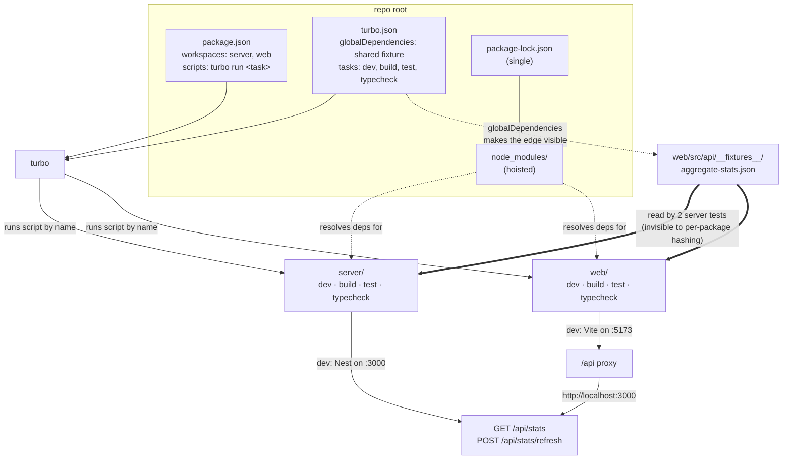

# Turborepo Monorepo Tooling Implementation Plan

> **Next step:** Use the `plan-to-task-breakdown` skill to expand each phase below into a detailed, parallelized task execution document before any implementation begins.

**Goal:** `npm run dev` at the repo root starts the NestJS server and the Vite dev server together, and `npm test` / `npm run build` / `npm run typecheck` at the root fan out across both packages — replacing today's per-package `--prefix` invocations.

**Architecture:** The repo is a monorepo in layout only — `server/` and `web/` each carry their own lockfile and `node_modules`, and the root `package.json` is a thin set of `--prefix` shims with no `workspaces` field. Turborepo does not manage installs; it reads the package manager's workspace config and orchestrates *scripts by name*. So the substantive change is the workspace consolidation (one root lockfile, hoisted `node_modules`), and `turbo.json` is a thin task graph layered on top: `dev` as a persistent uncached task, `build`/`test`/`typecheck` as cacheable ones. The one non-obvious wrinkle is that the two packages are not actually independent — the server's tests read a JSON fixture out of `web/`, an edge invisible to Turborepo's per-package hashing — so the task graph must declare that file globally or the cache will replay stale passes. Directory layout stays `server/` + `web/` at the root rather than moving to `apps/*`, because Turborepo does not require that convention and moving would invalidate every path reference in the existing plan, task doc, and README.

**Branch:** feature/DASH-0000-claude-usage-dashboard — this is tooling for the in-progress dashboard work and stays on its branch; carried through task breakdown and execution unchanged

---

## Requirements

### Functional

- A single root command starts both processes: the NestJS server on port 3000 and the Vite dev server on port 5173, with Vite's existing `/api` → `http://localhost:3000` proxy intact.
- Root-level `test`, `build`, and `typecheck` commands run the corresponding script in every workspace that defines it, and fail the root command if any workspace fails.
- A single `npm install` at the root installs dependencies for both packages.
- Task results for the non-persistent tasks are cached locally, so a re-run with no source changes replays instead of re-executing.

### Non-Functional

- **Behavior-preserving.** This changes how commands are invoked, not what the application does. No file under `server/src`, `web/src`, or either test suite changes its meaning.
- The root `test` task must terminate — it runs the suites once and exits with a status code, rather than entering an interactive watcher.
- **Cache correctness over cache hit rate.** A cache hit must be indistinguishable from a real run in both its verdict and its side effects. A replayed pass over changed inputs, or a replayed build that leaves no artifact, is a defect — not an optimization.
- Dependency resolution must not silently drift: the post-migration test suites must match a baseline captured immediately before the migration.
- The migration must not break the in-flight dashboard work executing from `docs/tasks/2026-08-01-claude-usage-dashboard-tasks.md`.
- No remote cache, no external account, no CI dependency. Local cache only.

## Assumptions

1. **npm stays the package manager.** npm 11.6.2 and Node 24.13.0 are what's installed; npm workspaces are mature and the alternative (pnpm) is a second migration stacked on the first. _Verified via `npm -v` / `node -v`._
2. **Hoisting is safe for these two packages.** The only dependencies they share are `typescript@^5.7.0` and `vitest@^4.1.10`, at identical ranges — so a hoisted root `node_modules` resolves one copy of each and neither package gets a version it did not already have. _Verified by diffing both manifests._
3. **The two packages have no *manifest* dependency edge, but they do have a *filesystem* one.** Neither `package.json` lists the other, so npm and Turborepo see no graph edge — but `server/test/stats.integration.test.ts:29` and `server/src/stats/stats.module.test.ts:16` both `path.resolve` up into `web/src/api/__fixtures__/aggregate-stats.json`, which the dashboard task doc declares the single source of truth for both suites. That edge is real, it is load-bearing for 10 tests, and Turborepo cannot infer it. _Verified by reading both files._
4. **`server/` and `web/` are the only workspaces.** There is no third package and no shared `packages/*` directory yet. _Verified by directory listing._
5. **Turborepo 2.x semantics apply** — top-level `tasks` key (not 1.x `pipeline`), `persistent`/`cache`/`outputs`/`globalDependencies` fields, schema at `https://turborepo.dev/schema.json`, and package manager declared via `devEngines.packageManager`. _From the current Turborepo docs; the installed turbo major must be confirmed at install time before the config is trusted._
6. **npm 11.6.2 honors `devEngines.packageManager`.** The field is supported from npm 11.5 onward and hard-fails installs on a version mismatch rather than warning. _Version verified; the failure mode is stated from the npm docs and should be confirmed by a deliberate mismatch during Phase 1._

## Options Considered

### Recommended: npm workspaces + Turborepo

- **Shape:** Root `package.json` gains `workspaces: ["server", "web"]` and a `turbo` devDependency; one root `package-lock.json` replaces the two per-package ones; `turbo.json` declares the four tasks plus the shared-fixture dependency; root scripts become thin `turbo run <task>` calls.
- **Pros:** One command for dev, one for test/build/typecheck. Turborepo's terminal UI gives each package its own labelled output pane instead of interleaved lines. Build/test/typecheck results are content-hashed and cached, so unchanged work is skipped. The task graph is declarative and grows correctly if a shared `packages/*` is ever added.
- **Cons:** One more dev dependency and a `.turbo` cache directory to ignore. The workspace consolidation is a real, slightly risky migration (see Risks) that has to happen regardless of runner. Caching introduces a *new* class of failure — a stale replay — that the current per-package setup cannot have.

### Not recommended: npm workspaces + `concurrently`

- **Shape:** Same workspace consolidation, but the root `dev` script is `concurrently "npm -w server run dev" "npm -w web run dev"`.
- **Pros:** Simpler, no cache layer, no daemon, one fewer concept — and structurally immune to the stale-replay class of bug. For exactly two packages this delivers most of the day-to-day benefit.
- **Cons:** No caching for test/build/typecheck, cruder output multiplexing, and the fan-out for non-dev tasks has to be hand-written per task.

### Not recommended: pnpm workspaces + Turborepo

- **Shape:** Switch package manager to pnpm with a `pnpm-workspace.yaml`.
- **Pros:** Faster installs, strict isolation with no phantom-dependency hoisting.
- **Cons:** Changes the install command in every doc and habit, and stacks a package-manager migration on top of a workspace migration for a two-package local project. Not worth it here.

**Recommendation:** npm workspaces + Turborepo. The workspace consolidation is required by every option; Turborepo adds a declarative task graph and caching on top of it for one dependency, and it is what the user asked for. The `concurrently` alternative is recorded because it is genuinely close in value at this repo size — if Turborepo's daemon, TUI, or cache correctness ever becomes friction, that is the fallback and the workspace half of the migration carries over unchanged.

## Architecture

### Flow / Concept Diagram

### Integration Points

- **npm workspaces** — owns installation and dependency resolution. Turborepo reads the `workspaces` array to discover packages but never installs anything itself. The single root lockfile becomes the source of truth for both packages' dependency versions.
- **`web/vite.config.mts`** — already sets `server.port: 5173` and proxies `/api` to `http://localhost:3000`. Unchanged by this work; it is what makes a single dev command produce a working app rather than two disconnected processes.
- **`server/src/main.ts`** — hardcodes `app.listen(3000)`, matching the proxy target. Unchanged.
- **Existing test tooling** — both packages run Vitest with their own config (`server/vitest.config.mts`, `web/vite.config.mts`). Turborepo invokes each package's `test` script with the package directory as cwd, so per-package config keeps working without change.
- **`web/src/api/__fixtures__/aggregate-stats.json`** — consumed by all 8 web test files *and* 2 server test files. Shared state that the package boundary does not contain.
- **`docs/tasks/2026-08-01-claude-usage-dashboard-tasks.md`** — an actively-executing task document containing 66 `--prefix`/lockfile/`node_modules` references, four of which are `npm install --prefix server`. Those four recreate the child lockfile and nested `node_modules` this migration removes, so they are a live collision, not a documentation nit.
- **`.claude/worktrees/`** — this repo runs parallel agents in git worktrees (one is present now). Each worktree is a separate checkout and therefore needs its own root install once dependencies are hoisted to the checkout root.

### Seams

- **`turbo.json` task graph → each package's `package.json` scripts.** The coupling is entirely by *script name*: `turbo run dev` invokes whatever script is called `dev` in each workspace. The contract is the set of names — `dev`, `build`, `test`, `typecheck` — present in **both** packages. _Fakeable — the task graph can be authored and reviewed against the declared name set before either package's scripts are touched, and vice versa._
- **Root script → Turborepo → package `test` script, via forwarded arguments.** The root test script passes `run` through Turborepo to each package's bare `vitest`. The contract is that every package's `test` script accepts a positional Vitest argument. _Fakeable — provable per-package without Turborepo present._
- **`web/src/api/__fixtures__/aggregate-stats.json` → the server test suite.** A file read across the package boundary at test time. _Not fakeable in the sense that matters here: whether the cache correctly invalidates on it can only be proved by editing the real file and observing a real cache miss._
- **Root `workspaces` array → hoisted `node_modules` → both packages' existing configs.** Whether Vite, Vitest, Nest's decorator metadata, and `ts-node` all resolve correctly out of a hoisted tree is not something a stand-in can answer. _Not fakeable — proved only by deleting the per-package trees, installing at the root, and running both real suites against the captured baseline._
- **Vite dev proxy → Nest HTTP server.** A single `dev` command is only successful if a request to `http://localhost:5173/api/stats` actually reaches the Nest controller. _Not fakeable — requires both processes genuinely running, so this is the final smoke check after the rest lands._

### Key Design Decisions

- **Consolidate to one lockfile rather than keeping per-package lockfiles.** npm workspaces produce a single root lockfile by design; leaving the child lockfiles in place would make them stale, misleading artifacts that no command reads. They get deleted, not preserved — and the root shims that would recreate them get deleted in the same step.
- **Declare the shared fixture as a global dependency.** Turborepo hashes a task against files in its own package; `inputs` globs are package-relative and cannot reach upward. Without an explicit declaration, editing the fixture leaves `server#test`'s hash unchanged and the cache replays a recorded pass over a suite that would now fail. The fixture path is therefore declared at the root of the task graph, where any change to it invalidates every task.
- **Declare build outputs.** A Turborepo task with no `outputs` caches logs only. Both packages build to a gitignored `dist/`, and the server's `start` script runs `node dist/main.js` — so an undeclared build would "succeed" from cache while leaving no artifact behind. `build` declares its output directory; `test` and `typecheck` declare none, and that emptiness is deliberate rather than forgotten.
- **No topological `dependsOn`.** The conventional `build: { dependsOn: ["^build"] }` orders a package's build after its *internal workspace dependencies* build. There is no manifest edge between `server` and `web`, so `^build` resolves to an empty set. It is left out under the "nothing speculative" rule. Note this is a statement about the *manifest* graph only — the fixture edge above is real and is handled separately, because it is a test-time file read, not a build-order constraint.
- **The root test script forwards `run` rather than renaming the packages' scripts.** Both `test` scripts are bare `vitest`, which watches in an interactive terminal, and Turborepo's TUI allocates a pty per task. Forwarding a positional `run` through Turborepo makes the root command single-run while leaving both package scripts byte-identical — which keeps the ~25 `npm test --prefix <pkg> -- run <path>` commands in the in-flight task doc working verbatim.
- **Root scripts stay thin.** `dev`, `build`, `test`, `typecheck` map onto `turbo run <task>`. The existing `server:install` / `server:test` / `server:dev` shims are superseded and removed, so there is exactly one way to run each thing.
- **Layout unchanged, and the workspace array is explicit rather than a glob.** No `git mv` into `apps/*`. Naming the two directories literally keeps every existing document's paths valid *and* prevents a glob from ever discovering the `server`/`web` copies inside `.claude/worktrees/`.
- **`web`'s `build` already runs its own typecheck** (`tsc --noEmit && vite build`, identical to its `typecheck` script), so a root run of both tasks type-checks `web` twice. Left as-is: the duplication predates this work and removing it means editing a package script for no functional gain.

## Risks & Mitigations

| Risk | Impact | Mitigation |
|------|:------:|------------|
| **Stale cache replay across the shared fixture.** Editing `web/src/api/__fixtures__/aggregate-stats.json` changes only `web`'s hash; `server#test` replays a recorded pass while its `toStrictEqual` assertion would now fail. A green root command over a genuinely red suite is the worst outcome this work can produce. | High | Declare the fixture in `globalDependencies`. The falsifiable check is behavioral, not structural: edit the fixture, run the root test task, and require the **server** suite to re-execute rather than report a cache hit. |
| **Cached build restores nothing.** With no `outputs` declared, deleting `dist/` and re-running root build yields a cache hit, replayed logs, and no artifact — after which `node dist/main.js` fails against a build that just "succeeded." | High | Declare `dist` as the build output. Verify by deleting both `dist/` directories, taking a cache hit, and requiring both directories to exist afterward with the same contents as a cold build. |
| **Dependency drift on re-install.** Every dependency uses a `^` range. Deleting both lockfiles and installing fresh at the root can resolve newer minors/patches than what is installed today, silently changing behavior under the banner of a tooling change. Identical test counts do not prove identical versions. | High | Capture the baseline test results *and* the resolved versions immediately before the destructive step; diff both afterward. Any deviation is a blocking failure, not a flake. If drift breaks something, pin the offending package rather than adapting the code. |
| **The in-flight task doc undoes the migration.** `docs/tasks/2026-08-01-claude-usage-dashboard-tasks.md` instructs `npm install --prefix server` in four places; an agent executing the dashboard wave would recreate the child lockfile and nested `node_modules` that Phase 1 removes. | High | Fix those four install commands as part of the migration itself, not as follow-up documentation. The other 62 references (`npm test --prefix …`) keep working unchanged and are deliberately left alone. |
| **A phase boundary that reverses itself.** If the lockfile deletion and the removal of the `server:*` shims land in different phases, the repo spends the interval carrying a one-command undo of the step just completed — and the breakdown dispatches phases as a parallel wave. | Medium | Both belong to the same phase. Phase 1 removes the shims; Phase 2 only adds `turbo run <task>` scripts. |
| **Hoisting breaks resolution for one of the toolchains.** Nest's `emitDecoratorMetadata` + `reflect-metadata`, `ts-node`'s CommonJS loading, and Vite's ESM resolution now all resolve out of one shared tree. Notably, no file under `server/` imports `reflect-metadata` directly — it arrives transitively through `@nestjs/core`, so a duplicated copy would fail in ways that are hard to localize. | Medium | Both real suites plus both typecheck scripts must be green post-install; the server integration test exercises the wired Nest app, which is where decorator-metadata breakage surfaces. Add a direct check that exactly one `reflect-metadata` resolves in the hoisted tree. |
| **A silently half-run task.** Turborepo skips packages that lack the named script and still exits 0 — so a missed `start:dev` → `dev` rename produces a `dev` command that starts Vite only, apparently successfully. | Medium | Require each root task to report **two** package-tasks, and treat the proxy smoke check as the specific detector for a server that never started. |
| **Uncommitted work in the tree during migration.** `web/src/App.tsx`, `web/src/App.test.tsx`, and `web/src/api/filterStats.test.ts` are modified but uncommitted, and the last commit records a fix in progress. A destructive install while those are in flight makes tooling breakage hard to distinguish from in-progress code. | Medium | Capture the baseline from the working tree as it stands immediately before Phase 1, and commit or stash before the destructive step so a bad install can be reverted cleanly. |
| **Agent worktrees have no dependencies after the migration.** Hoisted `node_modules` lives at the checkout root, and each worktree under `.claude/worktrees/` is a separate checkout. | Low | Note in the README that a fresh worktree needs its own root `npm install`. No tooling change. |
| **`devEngines.packageManager` mismatch hard-fails every install.** It blocks `npm install` outright rather than warning — and `npm install` is the command everything else in this plan depends on. | Low | Confirm the declared version matches the installed npm before relying on it, and treat a failed install with a package-manager error as a config bug rather than a dependency problem. |
| **CommonJS/ESM mismatch across packages.** `server` is `"type": "commonjs"`, `web` is `"type": "module"`. | Low | Each package keeps its own `package.json` and its own `type` field; workspaces do not merge them. Named only because it is the thing that *looks* dangerous about hoisting and is not. |
| **Turborepo daemon or TUI friction on this machine.** | Low | The `concurrently` fallback reuses the entire workspace half of the migration; backing out means deleting `turbo.json` and rewriting four root scripts. |

## Migration

This is a tooling migration with no data or API surface involved.

- **Database migrations:** None. The project has no database.
- **Breaking changes:** Developer-facing only. `npm run server:install`, `npm run server:test`, and `npm run server:dev` stop existing; `npm install --prefix server` stops being a valid install path anywhere, including inside the in-flight dashboard task document. `npm test --prefix <pkg> -- run <path>` is explicitly preserved and keeps working. No runtime or HTTP contract changes — `GET /api/stats` and `POST /api/stats/refresh` are untouched.
- **Rollback plan:** The change is confined to root `package.json`, `turbo.json`, `.gitignore`, lockfiles, the README, and four command lines in the dashboard task doc. Reverting the commit and re-running per-package installs restores the previous state; nothing outside the repo is mutated, and neither package's `scripts` block is modified at all.
- **Deployment order:** Not applicable — local development tooling.

## Testing Strategy

The unit of verification here is *the commands*, not new application tests. No new test files are expected; the existing suites are the instrument.

- **Unit:** No new unit tests. The existing server and web suites are the regression instrument and must pass unchanged in count and outcome.
- **Integration / E2E:** The single-command dev flow is the end-to-end case — both processes started by one root command, and a request through the Vite proxy reaching the Nest controller.
- **Regression locks** (each stated so a failure is unambiguous):
  - Both suites report **exactly the file and test counts captured immediately before Phase 1's destructive step**, and Phase 1 emits those captured numbers rather than inheriting them from this document — the working tree is actively changing, so an absolute number written here would read as a failure the moment the dashboard work advances.
  - The root test command **exits** and returns a status code — it does not sit in a watcher. A run that has not terminated after both suites report is a failure of this plan, not a slow machine.
  - The root test command returns **non-zero** when a package's suite fails, verified by deliberately breaking one test rather than by inspection.
  - Each root task reports **two** package-tasks. One is a silently skipped package, not a fast run.
  - There is **no `package-lock.json` under `server/` or `web/`** and exactly one at the root. Scoped to those paths deliberately: `.claude/` is gitignored and contains a full second checkout with its own lockfiles, so a bare `git status` check would pass regardless.
  - **Cache correctness, three separate observations:** touching a server source file produces a server cache **miss**; touching `web/src/api/__fixtures__/aggregate-stats.json` produces a **server** cache miss (not just a web one); and deleting both `dist/` directories then taking a cache **hit** on build still leaves both directories present and identical to a cold build.
  - `GET http://localhost:5173/api/stats` (through the Vite proxy, with both processes started by the single root dev command) returns **HTTP 200** with the same JSON body as `GET http://localhost:3000/api/stats` — a 404 or 502 means the proxy or the server did not come up, which is also the detector for a `dev` task that silently ran only one package.
  - `npm test --prefix server -- run <path>` still runs a single file and exits — the idiom the in-flight task doc depends on in roughly 25 places.
  - Both packages' `typecheck` scripts still exit 0 out of the hoisted tree.
- **Verification beyond tests:**
  - Confirm the installed `turbo` major matches the 2.x schema being written (Assumption 5) before trusting any of the config.
  - Diff resolved dependency versions pre- and post-migration — test counts alone cannot detect drift.
  - Confirm exactly one `reflect-metadata` resolves in the hoisted tree.
  - Confirm `.turbo` is ignored depth-agnostically: Turborepo writes per-package `<pkg>/.turbo/` log directories, not only a root one, so the ignore pattern must match at any depth.
  - Confirm no `npm install --prefix` remains anywhere in `docs/`.

## Implementation Phases

### Phase 1: Workspace consolidation

Turn the two independently-installed projects into one npm workspace: capture the pre-migration baseline (test counts and resolved dependency versions), declare `workspaces` and the package manager at the root, remove the three `server:*` shims in the same step that deletes the child lockfiles and dependency trees, then install once from the root. Removing the shims here rather than later is deliberate — leaving `server:install` in place while the lockfiles are gone hands the repo a one-command undo of the step just completed. The phase carries the migration's real risk (dependency re-resolution, hoisted module resolution) and is complete when both suites and both typecheck scripts are green out of the single hoisted tree, resolved versions match the captured baseline, and no lockfile remains under `server/` or `web/`. No Turborepo involvement yet; this phase must stand on its own, because it is also the foundation the `concurrently` fallback would reuse.

### Phase 2: Task graph

Add `turbo` as a root devDependency and author `turbo.json`: `dev` persistent and uncached, `build` cacheable with its output directory declared, `test` and `typecheck` cacheable with no outputs, and the shared web fixture declared as a global dependency so the server suite invalidates when it changes. Add the four thin root scripts, with the test one forwarding a positional `run` so the bare `vitest` scripts in both packages stay byte-identical and the in-flight task doc's file-scoped test idiom keeps working. Ignore `.turbo` at any depth. Neither package's `scripts` block is edited in this phase — the script-name set is a declared contract, so the graph can be authored against it independently. The phase is done when the graph declares exactly what it needs and nothing it does not.

### Phase 3: Prove the commands and reconcile the docs

Run the whole surface for real: the root dev command bringing up both processes with the proxy path returning live data, the root test command exiting with a correct status code on both success and an induced failure, root build and typecheck each reporting two package-tasks, and the three cache-correctness observations — source touch, fixture touch, and a cached build that still restores `dist/`. Then reconcile the documentation: rewrite the README's Development section around the root install and root dev command, and replace the four `npm install --prefix server` commands in the in-flight dashboard task doc, which would otherwise recreate exactly what Phase 1 deleted. This phase asserts against genuinely running processes, a real hoisted install, and real cache behavior, so no stand-in can prove it and it runs after the other two have landed.

## Decisions

1. **Workspace + runner** — npm workspaces with Turborepo on top: root `workspaces: ["server","web"]`, one root lockfile, `turbo` as a root devDependency. Chosen over npm workspaces + `concurrently` (simpler but no caching and hand-written fan-out) and over pnpm + Turborepo (a package-manager migration stacked on a workspace migration for a two-package project). _Decided by Eric, 2026-08-01._
2. **Directory layout** — `server/` and `web/` stay at the repo root, named explicitly in the `workspaces` array rather than matched by a glob. Chosen over moving to `apps/server` + `apps/web`, which is only a convention and would invalidate every path in the existing dashboard plan, task doc, and README. The explicit array also keeps a future glob from discovering the nested checkouts under `.claude/worktrees/`. _Decided by Eric, 2026-08-01._
3. **Task scope** — the full local task graph (`dev`, `build`, `test`, `typecheck`) rather than a dev-only shim, so root-level test and build work and get cached. Chosen over dev-only (leaves root `npm test` broken) and over adding remote caching (an account and token dependency with no CI to benefit from it). _Decided by Eric, 2026-08-01._
4. **Shared fixture edge** — declared via `globalDependencies` in `turbo.json`. Chosen over making `web` a real workspace dependency of `server` (a truer graph edge, but it declares a frontend app as a backend dependency to share one JSON file, and drags `^build` back in) and over relocating the fixture to a shared directory (cleanest long-term, but the in-flight task doc names that exact path as the single source of truth for 10 tests). The cost accepted is coarse invalidation: a fixture change busts every task's cache. _Decided by Eric, 2026-08-01._
5. **Non-interactive root test** — the root script forwards a positional `run` through Turborepo instead of renaming both packages' `test` scripts to `vitest run` with a separate `test:watch`. Chosen over the conventional rename because the rename breaks the `npm test --prefix <pkg> -- run <path>` idiom that the in-flight task doc uses in ~25 places and records as repo memory. The cost accepted is that a bare `turbo run test`, invoked directly rather than through the root script, still enters watch mode. _Decided by Eric, 2026-08-01._
6. **Build outputs declared, test/typecheck outputs deliberately empty** — `build` declares its `dist` output so a cache hit restores the artifact; `test` and `typecheck` produce no files and declare none. Recorded explicitly so the empty case reads as a decision rather than an omission. _Decided by Claude during planning, 2026-08-01._
7. **No topological `dependsOn`** — the task graph is flat. The `dependsOn: ["^build"]` idiom sketched when the task scope was chosen resolves to an empty set here, because there is no *manifest* dependency edge between the packages. Recorded rather than applied silently, since it differs from the option as presented. It becomes correct the moment a shared `packages/*` is introduced. _Decided by Claude during planning, 2026-08-01, under the repo's "nothing speculative" rule._
8. **The `server:*` shims are removed in Phase 1, not Phase 2** — same step as the lockfile deletion, so the repo never carries a documented command that reverses the migration mid-flight. _Decided by Claude during planning, 2026-08-01._
9. **The in-flight task doc's install commands are in scope; its test commands are not** — the four `npm install --prefix server` occurrences are corrected because they actively undo Phase 1; the ~62 `npm test --prefix …` occurrences are left untouched because Decision 5 keeps them working. Chosen over leaving the whole document stale behind a banner, which would leave a live foot-gun in an executing wave. _Decided by Claude during planning, 2026-08-01._
10. **Branch** — this work stays on `feature/DASH-0000-claude-usage-dashboard`. It is tooling for the dashboard already in progress on that branch, and the tree carries uncommitted dashboard changes that a new branch would strand. _Decided by Claude during planning, 2026-08-01._

## Open Questions

1. **[NEEDS REVIEW] OQ-1 — guard against a direct `turbo run test`.** Decision 5 leaves bare `turbo run test` (invoked directly rather than via the root script) entering watch mode. Should Phase 3 add a guard, or is documenting the root script as the only supported entry point enough? *Affects: Phase 3 only.* Under "document only", nothing is built and the README simply names the root commands as the interface. Under "guard", the likely mechanism is setting `CI=true` in the root test script so Vitest refuses to watch regardless of how it is reached — cheap, but it changes an environment variable that also affects reporter output. Eric owns this; "document only" is the working default if unanswered, and reversing it later is a one-line change.

## Non-Goals

Recorded so their absence is not mistaken for an oversight:

- **Serving the built frontend from the Nest server.** `server` builds to `dist/` and `web` builds a Vite bundle, but nothing assembles them — root `build` produces two artifacts with no deployment that consumes them. Out of scope until the dashboard needs a non-dev deployment; taking it on would add static-file serving to the server and would reinstate the topological `dependsOn` that Decision 7 omits.
- **Remote caching.** No CI exists to benefit from it, and it would add an account and a token to manage.
- **Migrating to pnpm, or restructuring into `apps/` + `packages/`.** Both are live options if the repo grows a third package; neither is warranted at two.
- **Deduplicating `web`'s `build` script**, which type-checks redundantly with its own `typecheck` script. Pre-existing, harmless, and outside the diff this work should touch.

## Success Criteria

- [ ] `npm install` at the repo root installs both packages, producing exactly one `package-lock.json` at the root and none under `server/` or `web/`.
- [ ] A single root command starts both the Nest server and the Vite dev server, and `http://localhost:5173/api/stats` returns HTTP 200 with the same body as `http://localhost:3000/api/stats`.
- [ ] Root `test` runs both suites, matches the baseline captured immediately before Phase 1, terminates, and exits non-zero when a package's suite is deliberately broken.
- [ ] Root `build` and `typecheck` each report two package-tasks and exit 0.
- [ ] Cache behavior is correct, not merely present: a server source edit misses; a `web/src/api/__fixtures__/aggregate-stats.json` edit misses **on the server task**; and a cached `build` after deleting both `dist/` directories restores them identically to a cold build.
- [ ] Resolved dependency versions are unchanged from the pre-migration baseline, and exactly one `reflect-metadata` resolves in the hoisted tree.
- [ ] Neither package's `scripts` block is modified, and no file under `server/src`, `web/src`, `server/test`, or either package's Vitest/Vite/tsconfig configuration changes. The diff is confined to root `package.json`, `turbo.json`, `.gitignore`, lockfiles, the README, and the four install commands in the dashboard task doc.
- [ ] `npm test --prefix server -- run <path>` still runs a single file, and no `npm install --prefix` remains anywhere in `docs/`.

## References

- [`docs/plans/2026-08-01-claude-usage-dashboard.md`](2026-08-01-claude-usage-dashboard.md) — the feature plan this tooling supports; establishes the `server/` + `web/` two-package architecture and the port/proxy arrangement this plan preserves.
- [`docs/tasks/2026-08-01-claude-usage-dashboard-tasks.md`](../tasks/2026-08-01-claude-usage-dashboard-tasks.md) — the in-flight task breakdown. Source of the shared-fixture contract (Assumption 3, Decision 4), the file-scoped test idiom this plan preserves (Decision 5), and the four install commands this plan corrects (Decision 9).
- [Adding Turborepo to an existing repository](https://turborepo.dev/docs/getting-started/add-to-existing-repository) — migration steps and the `devEngines.packageManager` declaration.
- [Configuring `turbo.json`](https://turborepo.dev/docs/reference/configuration) — `tasks`, `persistent`, `cache`, `outputs`, `globalDependencies`, and the `$schema` URL.
- [Developing applications](https://turborepo.dev/docs/crafting-your-repository/developing-applications) — persistent dev-task semantics and why nothing may `dependsOn` a persistent task.
- [Caching](https://turborepo.dev/docs/crafting-your-repository/caching) — why undeclared `outputs` cache logs only, and how file hashing determines invalidation.
