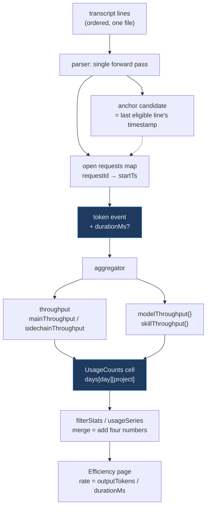

# Token Output Throughput Metric Implementation Plan

> **Next step:** Use the `plan-to-task-breakdown` skill to expand each phase below into a detailed, parallelized task execution document before any implementation begins.

**Goal:** Show how fast Claude actually generates output — tokens per second, bucketed over time and broken down by model, main vs sidechain, skill and project — from data already sitting in the transcripts.

**Architecture:** Claude Code records no response duration and no TTFT, so throughput is *derived*: each API request is bracketed by the timestamp of the last transcript line written before it began and the timestamp of its own final line. The parser computes that bracket in its existing single forward pass and hangs `durationMs` on the token event it already emits; the aggregator rolls duration and output tokens into four-number `ThroughputCounts` cells that merge by addition, exactly like the existing token totals. The frontend divides after merging — the same discipline the cache-hit and tool-error rates already follow — so a week's rate is weighted by volume rather than being the mean of its days' rates.

**Branch:** feature/DASH-0000-token-throughput-metric — carried through task breakdown and execution unchanged

---

## Requirements

### Functional

- Report output throughput (tokens/second) over the selected date range and projects, at the granularity chosen in the filter card (daily / weekly / monthly).
- Break throughput down by **model**, by **main vs sidechain**, by **skill**, and by **project**.
- Report how many requests were *excluded* from the metric, so a partial measurement never reads as a complete one.
- Preserve every existing number on the dashboard unchanged. This adds a metric; it corrects nothing.

### Non-Functional

- Throughput cells must merge associatively across day, project, and time-bucket boundaries — no metric that can only be computed at one granularity.
- The derivation stays inside the parser's existing single pass with O(open requests) state; no second pass over transcript lines and no growth in per-file parse cost beyond a small map.
- The parser stays pure: no clock, no fs, no ambient timezone. Durations are differences between two timestamps already present in the file.
- The persisted per-file cache must not silently serve pre-change entries that lack duration data.

## Assumptions

1. **A line's `timestamp` is when Claude Code wrote that line**, so the last line of a request lands at or near the end of its generation. _Supported, not proven: within multi-line requests the intra-request spread has a median of 3.14s and rises with response length (median 15.9s for responses over 2,000 output tokens), which is what per-block write times look like and not what a single write-at-end would look like._
2. **The measured interval is end-to-end response latency, not raw decode speed.** It includes queue wait, prompt processing / cache write, and time-to-first-token. This is a property of the metric, not a defect — but it means the number is "how fast did output arrive", and short responses are overhead-dominated. See OQ-1.
3. **The last line of a request can overshoot true stream end.** When a response ends in parallel `tool_use` blocks, an early tool's result is sometimes written before the later `tool_use` line is flushed — observed directly in a sampled request where a `tool_result` at `06:34:56.699` sits between two lines of `req_011Cdj8tFvFvc26pF5RWRdXe`. The overshoot is bounded by tool dispatch latency and was small in the sample, but it is unmeasured in aggregate and biases throughput *downward*.
4. **Transcript line types not seen in the sample behave like the ones that were.** The anchor-exclusion list (below) was derived from the line types actually present in 160 transcripts; a line type introduced by a future Claude Code version could become a bad anchor. Mitigated by the negative-duration guard rather than by prediction.
5. `<synthetic>` model entries are local, not API generations, and have no meaningful throughput. Excluded, consistent with their existing exclusion from model charts.
6. **The `requestId ?? uuid` dedupe fallback is negligible for grouping.** When `requestId` is absent the existing key falls back to the per-line `uuid`, which would make each such line its own single-line "request". _Measured: 8 of 14,424 usage-bearing assistant lines (0.06%) across the sampled main and sidechain transcripts. Those requests still resolve a valid anchor and a plausible duration, so they are left alone rather than special-cased._

## Options Considered

### Recommended: Two sums per cell, divide after merging

- **Shape:** `ThroughputCounts { outputTokens, durationMs, requests, excludedRequests }`. Merging two cells is adding four numbers; the rate is derived at render time.
- **Pros:** Associative at every granularity, so daily/weekly/monthly and per-project filtering all work with one code path. Matches the house pattern for cache-hit and tool-error rates. On the sampled data the volume-weighted rate (61.2 tok/s) and the median of per-request rates (61.0 tok/s) agree to within 0.2%, so the simpler shape costs essentially nothing in fidelity.
- **Cons:** Cannot show a distribution — no p50/p95, no histogram. A single slow outlier is invisible; it is averaged in by weight.

### Not recommended: Sums plus a fixed-bin histogram

- **Shape:** The four sums plus fixed tokens/second bins, so percentiles can be interpolated per bucket.
- **Pros:** Strictly more information; would surface variance and outliers that the weighted mean hides.
- **Cons:** Bin edges become part of the persisted cache format. Re-binning later requires invalidating every cache entry and re-scanning, and the bins would have to be chosen now, before anyone has looked at the metric.

**Recommendation:** Two sums. The measured agreement between weighted mean and median says the distribution is tight enough (p5 29.6, median 61.0, p95 86.8 tok/s on main transcripts) that a single number is honest. Histogram bins are a decision better made after the mean has been looked at for a while, and the shape above can be extended without disturbing what it already stores.

## Architecture

### Flow / Concept Diagram

### The derivation

Three rules, each of which was measured against real transcripts rather than reasoned about:

**Group by `requestId` across the whole file, never by contiguous run.** 20.5% of multi-line requests (400 of 1,954) have a foreign line interleaved between two of their own lines. Grouping by contiguous run splits those requests in two and mis-attributes the tail's full output-token count to a near-zero interval — with contiguous grouping the sampled p95 is 428 tok/s and the maximum 8,086 tok/s; with `requestId` grouping the same data gives p95 86.8 and maximum 116.1. The existing per-file dedupe map already groups this way, which is why this rule costs nothing to implement.

**Anchor on the last *eligible* preceding line.** Eligible means two things, and the first is easy to overlook: the line must **carry a timestamp at all**. 15.7% of transcript lines do not — seven types (`bridge-session`, `last-prompt`, `mode`, `permission-mode`, `ai-title`, `file-history-snapshot`, `custom-title`) are pure state records with no time on them. They can never be anchors and must never clear the candidate; they are simply passed over. No usage-bearing assistant line was missing a timestamp in the sample (0 of 14,424), so every request still resolves an end.

Second, three *timestamped* line types — `queue-operation`, `file-history-delta`, `pr-link` — are bookkeeping records written out of chronological order relative to their file position. Before excluding them, 101 of 2,832 requests (3.6%) produced a *negative* duration, and every single one was anchored to one of those three. Excluding them as anchor candidates eliminated every negative and every sub-second interval, and dropped the maximum observed rate from 8,086 to 116.1 tok/s. The remaining anchor types are `attachment` (1,431), `user` (1,036), and assistant lines of prior requests.

**Take output tokens from the deduped token event.** No new reading of `message.usage` and no change to the existing "last usage-bearing occurrence wins" rule. _Observation, not a dependency: in the sample, `output_tokens` was identical on all lines of a request in 1,954 of 1,954 multi-line requests, so last-wins is currently a no-op for output. The design does not rely on that staying true._

### Integration Points

- **`parser.ts`** — gains anchor-candidate and open-request-start state in the loop it already runs. The anchor update must sit alongside the existing earliest-timestamp tracking, *before* the early `continue` that skips non-assistant/user lines, because the plurality of anchors (`attachment`) are lines the parser currently discards as `ignoredLines`. The ordering inside that block is the subtle part: a line's own anchor has to be read off the candidate **before** the candidate advances to that line, or every request anchors to itself and every duration collapses to zero. The `continue` means this cannot be deferred to the end of the loop body.
- **`aggregator.ts`** — one new branch inside the existing `token` case of `addToCounts`, plus the new cells in `emptyCounts` and `sortCounts`. `sortCounts` spreads `...counts` and then sorts each record by name, so the two new records pass through **unsorted unless explicitly added** — and nothing in the type system catches it. This is the one place where a miss is silent.
- **Every full `UsageCounts` literal** must gain the new fields. Because the fields are required, TypeScript catches all of them except two: the shared JSON fixture as consumed by the *server* test (read by relative path, untyped), and `sortCounts` above. The web side is protected — `web/src/api/types.test.ts` does `fixture as AggregateStats`, and that assertion fails to compile on a missing required key.
- **`file-cache.ts`** — `fileCacheKey` gains a schema version segment. See Migration; this is the part most likely to be forgotten.
- **`web/src/api/filterStats.ts`** — `mergeUsageCounts` gains three scalar cells and two records.
- **`web/src/pages/Efficiency.tsx`** — the page that already owns rate-shaped metrics (cache hit, tool error) and already imports the `Gauge` icon.

### Seams

- **parser → aggregator:** the `token` variant of `UsageEvent` gains an optional `durationMs`. _Injectable — the aggregator's tests construct `UsageEvent` values directly and never call the parser, so both sides can be built at once against the declared field._
- **aggregator → both contract files:** `ThroughputCounts` and the five new `UsageCounts` fields, declared independently in `server/src/stats/contracts.ts` and `web/src/api/types.ts`. _Fakeable — every consumer builds against the interface; the two declarations are hand-kept in sync by convention, not by import._
- **`filterStats` / `usageSeries` → pages:** `SeriesPoint.counts` carries the new cells. _Fakeable — pages are pure functions of `{ stats, series, granularity }` and their tests already build `UsageCounts` literals._
- **shared fixture → server module test + web page tests:** `web/src/api/__fixtures__/aggregate-stats.json` is read by `stats.module.test.ts` by relative path and by every page test, with headline numbers hand-computed and asserted. _Not fakeable — one physical file with three sets of consumers and arithmetic that must be redone by hand. It is a single owner with a broadcast, not a contract two sides can approximate._
- **derivation → real transcripts:** that the rules above hold on actual `~/.claude/projects` data. _Not fakeable — synthetic fixtures prove the arithmetic, not the assumption that anchors behave. Proved once, at the end, against real files._

### Key Design Decisions

- **`ThroughputCounts` nests inside `UsageCounts`, so `AGGREGATE_STATS_KEYS` does not change.** The eleven pinned top-level keys stay eleven and the cross-package key contract test needs no edit — only the minimal-`AggregateStats` literal inside it, which TypeScript will force.
- **Duration rides on the existing token event rather than a new `UsageEvent` kind.** A `throughput` event kind would double event volume in the cache file and would need its own dedupe; the token event is already deduped per `requestId` with last-wins, which is precisely the grouping the derivation needs.
- **Requests below a minimum output size are excluded, not floored.** They are overhead measurements, not throughput measurements. Excluding them and *counting the exclusions* is honest; silently including them would drag every bucket toward the fixed-cost floor, and silently dropping them would make a partial metric look total.
- **No duration means excluded, never zero.** A request with no resolvable anchor (first request in a file) or a non-positive interval contributes to `excludedRequests` only. A zero-duration contribution would divide by zero at render; a zero-token contribution would silently deflate the rate.

## Risks & Mitigations

| Risk | Impact | Mitigation |
|------|:------:|------------|
| Stale cache entries lack `durationMs`, so all history shows zero throughput forever — transcripts are append-only, so old files never change their mtime/size and never re-parse | **High** | Add a schema-version segment to `fileCacheKey`. Invalidates every entry exactly once, forcing one full re-scan. This is the single most likely thing to be missed. |
| A future Claude Code version adds a line type that anchors badly, silently corrupting the metric | Med | Guard: non-positive intervals are excluded and counted, never stored. A corrupted anchor shows up as a rising `excludedRequests`, not as a wrong number. |
| The metric is read as "how fast the model decodes" when it is "how fast output arrived", including queue and prompt-processing time | Med | Name and label it as response throughput in the UI copy, and state the inclusion explicitly rather than in a tooltip footnote. |
| Fixture arithmetic is edited without redoing the hand-computed headline numbers, breaking assertions in two packages | Med | Single-owner seam: one task owns the fixture and broadcasts the recomputed values; consumers assert against what it publishes. |
| The two new records skip `sortCounts` and ship unsorted, breaking the aggregator's sort-everything invariant with no type error and no failing test | Med | An explicit sort-order regression lock (see Testing Strategy), because this is the only new-field omission the compiler cannot catch on the web side and one of two it cannot catch at all. |
| Parallel-`tool_use` overshoot biases throughput downward by an unmeasured amount | Low | Accept and document. The bias is one-directional and bounded by tool dispatch latency; correcting it would require inferring stream end from data the transcript does not record. |

## Migration

- **Database migrations:** None — there is no database.
- **Cache format change:** `ParsedFile` gains an optional field on token events. Old cache entries remain structurally valid JSON and would be served silently, producing zero throughput for every unchanged transcript. Because transcripts are append-only, "unchanged" means "nearly all history". The cache key therefore gains a schema-version segment so every pre-change entry misses.
  - The exact key string is pinned by a test (`'/r/-a/s.jsonl:1700000000000:42:Asia/Hong_Kong'` in `file-cache.test.ts`). Changing it is a deliberate contract change, and that test must change with it.
  - `.cache/stats-cache.json` does not currently exist in this checkout, so on this machine the first run rebuilds regardless. The version segment is for every other checkout and for the next schema change.
- **Breaking changes:** None user-facing. `AggregateStats`'s top-level shape is unchanged; `UsageCounts` grows, and both hand-kept declarations must grow together or the packages disagree silently.
- **Rollback plan:** Revert the branch. The cache self-heals on the next refresh because the version segment moves back.
- **Deployment order:** N/A — single local app, no deploy.

## Testing Strategy

- **Unit — parser:** duration derivation against hand-built line sequences. The cases that matter are the ones measurement showed to be real: a request whose lines are interleaved with a foreign line, a request anchored to a bookkeeping line type, a request that is the first thing in its file, and a request whose anchor is another request's tail.
- **Unit — aggregator:** that eligible events accumulate into all five cells and ineligible ones increment `excludedRequests` only; that `<synthetic>` contributes to no cell.
- **Unit — frontend merge:** that `mergeUsageCounts` adds the new cells, and that a two-day week whose days have different rates produces the volume-weighted rate, not the mean of the two rates.
- **Integration:** the shared fixture flows through `stats.module.test.ts` and the Efficiency page test with consistent throughput numbers on both sides.
- **Regression locks** — each phrased so a wrong result is visible:
  - `AGGREGATE_STATS_KEYS` still contains exactly the eleven keys `agents, days, generatedAt, ignoredLines, malformedLines, models, projects, scannedFiles, skills, tools, totals` — a twelfth is a contract change, not an incidental one.
  - For the shared fixture, `totals.tokens.total` and every `totals.models[*]` entry keep the values they have today, digit for digit.
  - `throughput.requests + throughput.excludedRequests` equals the number of deduped token events in the aggregate — no request is counted twice and none vanishes.
  - `fileCacheKey` with the inputs pinned in `file-cache.test.ts` returns a string *different* from `'/r/-a/s.jsonl:1700000000000:42:Asia/Hong_Kong'`. If it still returns the old string, the invalidation did not happen.
  - A transcript with zero usage-bearing lines still yields `throughput.durationMs === 0` and renders without dividing by zero.
  - `modelThroughput` and `skillThroughput` come out of the aggregator with their keys in sorted order, like every other record on `UsageCounts`. Feed the aggregator events whose model names arrive in reverse-alphabetical order and assert `Object.keys(...)` is ascending — `sortCounts` will pass them through untouched if they were not explicitly added to it, and no type error will say so.
- **Verification beyond tests:** run the real pipeline against `~/.claude/projects` and confirm the headline rate lands near 61 tok/s for main and that `excludedRequests` is a small fraction of `requests`. A headline in the hundreds means grouping regressed to contiguous runs; a headline near zero means the cache served stale entries.

## Implementation Phases

### Phase 1: Derive duration in the parser

Teach the parser to bracket each request: track an anchor candidate updated by every timestamped line except the three bookkeeping types, and a per-`requestId` start timestamp frozen on first sight, so the deduped token event carries `durationMs`. This phase also bumps the cache-key schema version, because the two changes are one thought — a new field in `ParsedFile` is worthless while stale entries without it are still being served. Done when the derivation is proved against interleaved, bookkeeping-anchored, and first-in-file line sequences, and the pinned cache-key string has deliberately changed.

### Phase 2: Aggregate and carry the contract

Declare `ThroughputCounts` in both contract files, roll eligible token events into the overall, main/sidechain, per-model and per-skill cells in the aggregator, and extend the frontend merge so the cells survive filtering and time bucketing. Per-project needs no new cell — `days[day][project]` already partitions this way. The shared fixture gains throughput numbers with its arithmetic redone by hand, and it is owned by exactly one task that publishes the recomputed values to the tests on both sides. Done when a filtered, weekly-bucketed selection produces a volume-weighted rate and the existing token assertions in both packages are untouched.

### Phase 3: Surface it on the Efficiency page

Add a headline throughput tile and a time-bucketed throughput chart alongside the existing rate metrics, plus the per-model comparison — two models today, well inside the five-hue limit, so series keep their identity-ordered colours. The excluded-request count is surfaced rather than hidden, and the copy says response throughput including queue and prompt-processing time, not "generation speed". Done when the page renders from the fixture at all three granularities and the metric reads honestly to someone who did not write it.

## Decisions

1. **Summarization shape** — two sums per cell, rate divided after merging. Chosen over sums-plus-histogram because the measured distribution is tight (weighted mean 61.2 vs median 61.0 tok/s) and histogram bin edges would be frozen into the cache format before anyone has looked at the metric. _Decided by Eric, 2026-08-05._
2. **Breakdown scope** — overall plus per-model, main vs sidechain, per-skill, and per-project. Chosen over overall-only; per-project is free at the cell level and the rest reuse existing record patterns. _Decided by Eric, 2026-08-05._
3. **Ticket** — `DASH-0000`, the repo convention for unticketed work. Confirmed as a personal project with no ticket board. _Decided by Eric, 2026-08-05._
4. **`<synthetic>` excluded from throughput** — consistent with its existing exclusion from model charts; it is not an API generation and has no meaningful rate. Chosen over including it in the overall cell, which would mix local operations into a network-latency-inclusive metric. _Decided during planning, 2026-08-05._

## Open Questions

1. **[NEEDS REVIEW] OQ-1 — minimum output size for inclusion.** Exclude requests below 100 output tokens, or pick a different threshold? *Affects Phase 2 only, as a single constant in the aggregator.* At 100 tokens the sample keeps 99.0% of main requests and 99.9% of main output tokens, while sidechains keep 83% of requests and 94.3% of output tokens — the gap is because subagent responses skew short and overhead-dominated. A lower threshold raises coverage and drags the rate down toward the fixed-cost floor; a higher one measures steady-state generation more cleanly and excludes more. Reversing it is a one-line change plus a re-scan.
2. **[NEEDS REVIEW] OQ-2 — how prominently to show `excludedRequests`.** A always-visible coverage line, or only a tooltip when exclusions exceed some share of requests? *Affects Phase 3 only.* The requirement is that a partial measurement never reads as complete; where exactly that disclosure sits is a UI judgement best made once the tile exists.

## Success Criteria

- [ ] The dashboard reports output throughput over the selected range and projects, at daily, weekly and monthly granularity, with the weekly figure weighted by volume rather than being the mean of its days' rates.
- [ ] Throughput is broken out by model, main vs sidechain, skill, and project.
- [ ] Running against real `~/.claude/projects` data produces a main-transcript headline near 61 tok/s, with `excludedRequests` a small and visible fraction of `requests`.
- [ ] Requests with interleaved lines produce exactly one throughput record each; no request contributes twice and none is silently dropped.
- [ ] Every pre-existing number on the dashboard is unchanged, and `AGGREGATE_STATS_KEYS` still has eleven entries.
- [ ] Pre-change cache entries cannot be served, in this checkout or any other.

## References

- `docs/plans/2026-08-01-claude-usage-dashboard.md` — the Decisions section behind the pipeline shape, the per-file dedupe rule, and the "bucket days once, in the aggregator" invariant this plan inherits.
- `docs/tasks/2026-08-01-claude-usage-dashboard-tasks.md` — the contract-registry and Final Gate pattern this work's task breakdown should follow.
- `CLAUDE.md` — "Invariants that tests lock", in particular per-file token dedupe, sidechains as the sole source of subagent tokens, and the rates-divide-after-merging rule for time-bucketed charts.
- Measurements underpinning this plan were taken 2026-08-05 over the 40 most-recently-modified main transcripts (2,850 requests) and the 120 most-recently-modified sidechain transcripts (3,890 requests) in `~/.claude/projects`, on Claude Code 2.1.222. They are a sample of recent usage, not the full corpus.
