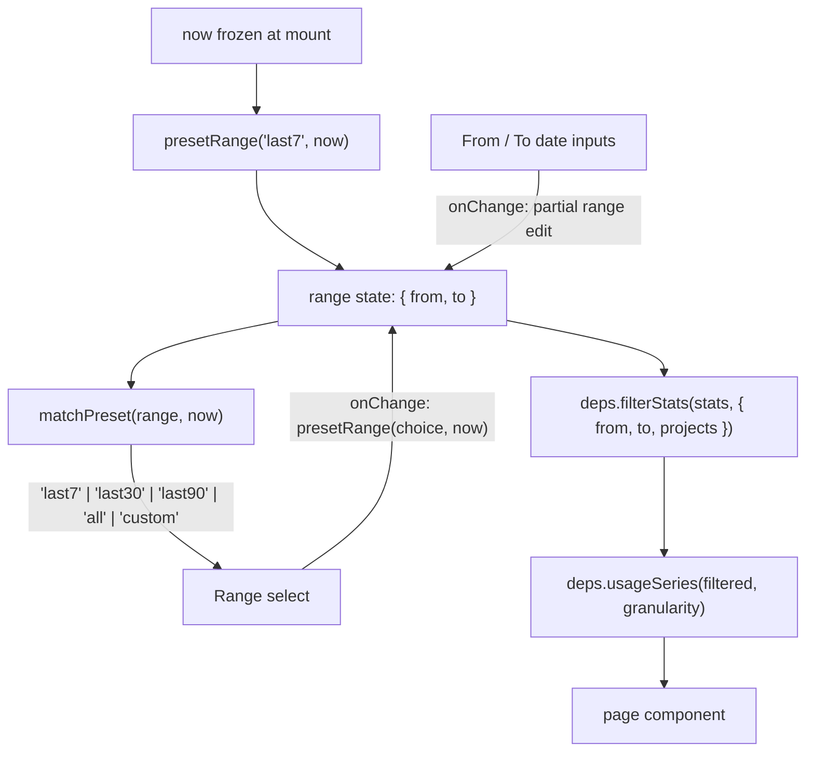

# Date Range Presets Implementation Plan

> **Next step:** Use the `plan-to-task-breakdown` skill to expand each phase below into a detailed, parallelized task execution document before any implementation begins.

**Goal:** Let the user jump the dashboard's date window to the last 7, 30, or 90 days (or all time) from a single select, without giving up the arbitrary From/To range the filter card supports today.

**Architecture:** `from`/`to` stay the single source of truth for filtering — the preset is *derived* from them, not stored next to them. A new pure module vocabulary in `web/src/api/dateRange.ts` maps a preset to a `{ from, to }` pair (`presetRange`) and maps a `{ from, to }` pair back to the preset it matches, or `'custom'` (`matchPreset`). The filter card's Range select renders `matchPreset(range, now)` and writes `presetRange(choice, now)`; editing either date input therefore flips the select to Custom for free, with no second piece of state to keep in sync and no way for the two controls to disagree. `now` is frozen once at mount — the same `now` that already anchors the opening window — so the derivation is stable for the session and deterministic under test.

**Branch:** feature/DASH-0000-date-range-presets — carried through task breakdown and execution unchanged. Work happens in the git worktree at `.claude/worktrees/date-range-presets`.

---

## Requirements

### Functional

- A **Range** select in the filter card, alongside the existing From / To / Group by controls, offering: Last 7 days, Last 30 days, Last 90 days, All time.
- Choosing a preset rewrites both date inputs and re-filters the dashboard immediately.
- Each "last N days" window is inclusive of both ends and counts today as one of the N days — the semantics `DEFAULT_RANGE_DAYS`/`defaultDateRange` already implement for 7.
- "All time" clears both bounds (`from`/`to` empty), which `filterStats` already reads as unbounded.
- Editing From or To by hand still works and puts the select into a **Custom** state; Custom is a readout, not something the user picks.
- The dashboard still opens on Last 7 days, and the opening window still does not slide forward mid-session.

### Non-Functional

- Preset arithmetic stays pure: no clock read, no `toISOString()`, no ambient-timezone dependency. Day keys are local calendar dates, built through the existing `toDayKey`.
- No server change, no contract change. `AggregateStats`, `StatsFilter`, and `AGGREGATE_STATS_KEYS` are untouched, so `server/src/stats/contracts.ts` and `web/src/api/types.ts` stay in sync by not moving.
- No new dependency and no new shadcn component: the select matches the existing Group by `<select>` markup and classes.

## Assumptions

1. **Only `App.tsx` consumes `defaultDateRange`.** Verified by reading `web/src/App.tsx:8,62`; no other importer was found.
2. **`filterStats` treats an absent bound as unbounded.** `App.tsx:70-74` already passes `from || undefined` / `to || undefined`, and the empty state's "Show all time" button sets both to `''` and is asserted to restore the full dataset (`App.test.tsx`, "recovers from the empty state by clearing the range to all time"). So All time needs no new filtering behaviour.
3. **A 90-day window is not a performance concern.** Filtering is client-side over the pre-bucketed `days` map, and the map is bounded by how many days of transcripts exist locally — order hundreds of keys. Unmeasured, but the same code path already handles the unbounded All-time case, which is strictly larger.
4. **90 daily x-axis points are legible enough to ship without forcing a granularity change.** Judgement call, not measured; the user can switch Group by to Weekly. See OQ-1.

## Options Considered

### Recommended: Derive the preset from `{ from, to }`

- **Shape:** `range` remains the only state. The select's value is `matchPreset(range, now)`; its `onChange` writes `presetRange(value, now)`.
- **Pros:** Impossible for the select and the date inputs to disagree, because there is nothing to synchronise. Editing a date input needs no extra handler change to reset the select. Adds one pure, exhaustively unit-testable function.
- **Cons:** Typing a range by hand that happens to equal the last 7 days shows "Last 7 days" rather than "Custom". Also means `matchPreset` must be given the same frozen `now` the range was built from, or a preset picked before midnight would read as Custom after it.

### Not recommended: Store the preset as its own state

- **Shape:** `const [preset, setPreset] = useState('last7')` next to `range`; every date-input `onChange` also calls `setPreset('custom')`.
- **Pros:** "Custom" is explicit and sticky — a hand-typed range that coincides with a preset window still reads as Custom.
- **Cons:** Two sources of truth for one concept. Any future code path that sets `range` (the empty state's "Show all time" button already does) must remember to update `preset` too, and forgetting is a silent desync that no type check catches.

**Recommendation:** Derive. The only thing the stored variant buys is a more literal "Custom", and that edge — a hand-typed range identical to a preset — is arguably *correctly* labelled by the derived version anyway. The desync class of bug it avoids is real and already has a candidate site in the empty state.

## Architecture

### Flow / Concept Diagram

### Integration Points

- **`web/src/api/dateRange.ts`** — gains the preset vocabulary. `toDayKey` and the inclusive-window arithmetic already there are reused, not reimplemented; `defaultDateRange` is kept as the `'last7'` case so its existing tests and the opening-window guarantee survive unchanged.
- **`web/src/App.tsx`** — the filter card grows a fourth control. `now` is already injected through `AppDeps.now` and already frozen at mount by the `range` initialiser; this work needs that same frozen value available to the render pass, which today it is not.
- **`web/src/api/filterStats.ts`** — read only. `StatsFilter` is unchanged; presets exist entirely above it.
- **Empty state** — its "Show all time" button sets `{ from: '', to: '' }`, which `matchPreset` must classify as `'all'` so the select follows the button rather than reading Custom.

### Seams

- **`dateRange` preset vocabulary → `App`:** a preset identifier, its label, `presetRange(preset, now) → { from, to }`, and `matchPreset(range, now) → preset`. _Direct import, not injected — but pure and total over a `now` the App already receives through `deps.now`, so `App`'s tests assert real day-key strings against a fixed clock and need no stand-in. The consumer can be written against the declared signature before the module exists._
- **`App` → filter card DOM:** a labelled `Range` select whose accessible name is `Range` and whose option values are the preset identifiers. _Fakeable — asserted through the rendered markup with the existing fake `deps`._
- **`App` → real `filterStats` / `usageSeries`:** that a 90-day or All-time selection actually widens what the page renders. _Not fakeable — this asserts against the real filtering layer wired into the assembled component (the `App integration with the real filtering layer` suite), so it is proved once the control exists._

### Key Design Decisions

- **The preset is derived, never stored** — one source of truth, so the select and the date inputs cannot disagree. See Options Considered.
- **`now` is frozen once at mount and shared** by the range initialiser and the derivation, so a session's preset label stays stable across a midnight boundary and matches the window it produced.
- **Custom is a rendered-only option.** It appears in the select solely when `matchPreset` returns it, so there is no selectable option whose `onChange` would have nothing to do.
- **"All time" is a preset value, not a separate control**, because the empty state already produces that exact range and the select needs a truthful label for it.
- **Preset choice does not touch `granularity`.** Range and grouping stay orthogonal — the same discipline the plan for time-bucketed charts established, where pages read `granularity` and never re-bin.

## Risks & Mitigations

| Risk | Impact | Mitigation |
|------|:------:|------------|
| Preset arithmetic drifts to `toISOString()` and shifts day keys by one for a non-UTC user | Med | Every preset window is built through the existing `toDayKey`; unit coverage asserts a preset boundary at a late-evening local `now`, the case that already broke once and is locked in `dateRange.test.ts` |
| Off-by-one in "last N days" — 90 days rendered as 91 or 89 | Med | Windows are inclusive of both ends with today counted; each of 7/30/90 gets an explicit expected `{ from, to }` pair, plus a month- and a year-boundary crossing |
| `matchPreset` and `presetRange` disagree, so choosing a preset immediately reads as Custom | Med | A round-trip assertion per preset: `matchPreset(presetRange(p, now), now) === p` |
| 90 days at daily granularity produces an unreadably dense x-axis | Low | Ship as-is; Group by Weekly is one control away. Tracked as OQ-1 rather than pre-solved |
| The opening window silently changes, or starts sliding mid-session | Med | The existing `App default date range` tests stay untouched and must keep passing; `defaultDateRange` keeps its name and its 7-day meaning |

## Migration

No migration required. No schema, no persisted state, no API surface — the feature is client-side UI state and pure date arithmetic.

## Testing Strategy

- **Unit (`web/src/api/dateRange.test.ts`):** the preset table is complete and labelled; `presetRange` returns the exact inclusive `{ from, to }` for each of 7 / 30 / 90 at a fixed `now`, crosses month and year boundaries backwards, and returns empty bounds for All time; `matchPreset` classifies each preset's own output, classifies `{ from: '', to: '' }` as All time, and classifies an arbitrary hand-typed pair as Custom; round-trip identity holds for every preset; neither function mutates the `Date` it is given.
- **Component (`web/src/App.test.tsx`):** the Range select exists with accessible name `Range` and opens showing Last 7 days; choosing Last 30 days makes the next `filterStats` call receive `from`/`to` 30 days apart and updates both date inputs; choosing All time passes `from: undefined, to: undefined`; editing the From input by hand makes the select read Custom; clicking the empty state's "Show all time" leaves the select reading All time, not Custom.
- **Integration (real filtering layer):** with the shared fixture and a `now` that puts the fixture's days outside the 7-day window but inside the 90-day one, the page renders the empty state before the preset change and real data after it — proving the widening reaches the actual filtering path and not just the inputs.
- **Regression locks:** the dashboard's first `filterStats` call still receives exactly the seven days ending on the injected `now`, inclusive — an eighth day, or a `from` that is not `now - 6`, proves it broken. The `range` initialiser still runs once: advancing the injected clock and switching pages must leave `from`/`to` byte-identical to the first call. `AGGREGATE_STATS_KEYS` and the shared fixture are not edited, so `server`'s `stats.module.test.ts` and the web contract test pass without change — a diff touching either file proves the "no contract change" claim broken.
- **Verification beyond tests:** `npm run typecheck` and `npm test` at the repo root, then a manual pass in `npm run dev` confirming each preset visibly moves the charts and that the select tracks hand-edited dates.

## Implementation Phases

### Phase 1: Preset vocabulary

Extend `web/src/api/dateRange.ts` with the preset identifiers, their dropdown labels, `presetRange`, and `matchPreset`, keeping `toDayKey` and `defaultDateRange` as the reused inclusive-window primitives. This phase is pure date arithmetic with no React and no imports beyond what the module already has. Done when the preset unit suite — including the round-trip identity and the late-evening local-`now` boundary — passes, and `defaultDateRange`'s existing tests still pass untouched.

### Phase 2: Range control in the filter card

Add the Range select to `App.tsx`'s filter card as a fourth control matching the Group by select's markup, lift the frozen mount-time `now` so the render pass can derive from it, and wire the select to `presetRange` / `matchPreset`. Nothing else in the filter card changes and no page component is touched. This phase codes against Phase 1's declared signatures rather than its finished file, so the two run together. Done when the component-level assertions above pass and the existing default-range regression tests are still green.

### Phase 3: Prove it through the real filtering layer

Extend the `App integration with the real filtering layer` suite so a preset change is asserted against real `filterStats` / `usageSeries` over the shared fixture — empty state at 7 days, real data at 90. This is the one surface no stand-in can prove, since the point is that the widened bounds reach the actual filtering code, so it lands after the control exists. Done when the suite distinguishes those two states and the full root `npm test` and `npm run typecheck` are clean.

## Decisions

1. **Select plus derived Custom, not a chip row** — the Range control is a `<select>` next to Group by; picking a preset writes From/To and hand-editing a date reads back as Custom. Chosen over a row of toggle chips (and over dropping the From/To inputs entirely, which would regress arbitrary ranges) because it reuses the existing Group by control's markup, adds one control instead of a second selection-state surface, and keeps arbitrary ranges. _Decided by the user, 2026-08-07._
2. **Preset set is 7 / 30 / 90 days plus All time; the dashboard still opens on 7** — All time is included because the empty state already produces that range and the select needs a truthful label for it, rather than showing Custom. Chosen over the bare three presets, and over widening the opening window to 30 days, because widening would change shipped behaviour for no stated reason. _Decided by the user, 2026-08-07._
3. **Ticket is `DASH-0000`** — the user confirmed no ticket exists for personal-project work; `DASH-0000` is this repo's established placeholder, matching `feature/DASH-0000-model-cost-and-efficiency` and the two prior plans. Chosen over an unticketed branch name so the branch and frontmatter shape stay uniform. _Decided by the user, 2026-08-07._

## Open Questions

1. **[NEEDS REVIEW] OQ-1 — granularity coupling on wide ranges.** Should picking Last 90 days auto-switch Group by from Daily to Weekly, or leave grouping entirely to the user? *Affects Phase 2 only.* Under "leave it" (the default this plan implements), the select writes only `range` and 90 daily points are plotted as-is. Under "auto-switch", the preset handler also calls `setGranularity`, which means preset changes can silently overwrite a deliberate grouping choice and needs a rule for when it may not. Owner: the user, after seeing the 90-day chart in `npm run dev`.
2. **[NEEDS REVIEW] OQ-2 — fate of the empty state's "Show all time" button.** Keep it now that All time is a preset, or remove it as redundant? *Affects Phase 3 only.* Under "keep" (the default), it stays and is asserted to leave the select reading All time. Under "remove", the empty state loses its action and its recovery test moves onto the Range select. Owner: the user; keeping it costs nothing and the button is the more discoverable recovery path from an empty chart.

## Success Criteria

- [ ] The filter card offers Last 7 days / Last 30 days / Last 90 days / All time, and each one visibly changes what the charts cover.
- [ ] The active preset always reflects the current From/To — hand-editing a date reads Custom, and the empty state's "Show all time" reads All time.
- [ ] Every "last N days" window is inclusive of both ends with today counted, and correct for a non-UTC local zone.
- [ ] The dashboard still opens on the seven days ending today and the window still does not slide mid-session.
- [ ] No server file, no contract file, and no shared fixture is modified; root `npm test` and `npm run typecheck` are clean.

## References

- `docs/plans/2026-08-01-claude-usage-dashboard.md` — the Decisions section that established client-side filtering over a single aggregate endpoint, pre-bucketed day keys, and the rule that the frontend never re-derives a day from a timestamp.
- `docs/plans/2026-08-05-token-throughput-metric.md` — most recent plan in this repo; the frontmatter and phase shape this plan follows.
- `CLAUDE.md` — the frontend section on the filter card, granularity bucketing, and the cross-package contract this work deliberately does not touch.
