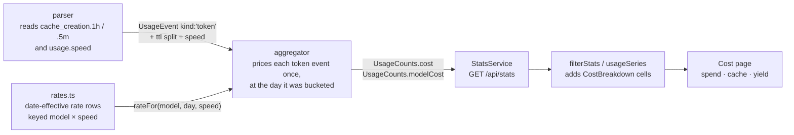

# Per-Model USD Cost and Token Efficiency Implementation Plan

> **Next step:** Use the `plan-to-task-breakdown` skill to expand each phase below into a detailed, parallelized task execution document before any implementation begins.

**Goal:** Answer two questions the dashboard cannot answer today — *how many USD did each model cost me*, and *am I spending those tokens efficiently on each model* — from data already in the transcripts.

**Architecture:** Cost is money, so it is computed once in the aggregator (where the day key still exists and rates can be date-effective) and stored as **mergeable integer micro-USD cells**, exactly like the existing `ThroughputCounts`. The frontend sums cells and never multiplies a rate. Pricing needs a dimension the parser currently discards: `cache_creation` splits into 1-hour and 5-minute TTL tokens, which price at 2× and 1.25× base input respectively — so `TokenUsage` gains that split while `TokenTotals` keeps `cacheCreation` as their sum, leaving every existing chart's arithmetic untouched. A model with no rate row is never guessed at: its tokens accumulate into an `unpricedTokens` counter so the total stays auditable, the same honesty discipline `throughput.excludedRequests` already follows — though no model in the current data is unpriced, so the counter ships without a page surface.

**Branch:** feature/DASH-0000-model-cost-and-efficiency — carried through task breakdown and execution unchanged

---

## Requirements

### Functional

- Report **USD per model** over the selected date range and projects, broken into input / output / cache-write / cache-read spend.
- Report **cost share vs token share** per model, and **cost per 1M tokens** per model — the "is an expensive model doing cheap work" lens.
- Report **cache economics per model**, showing both sides of the trade: cache-**write** spend (the premium paid), cache-**read** spend (the discount enjoyed), and the **net USD saved** against the uncached counterfactual — see the formula under Key Design Decisions. Plus the cache hit ratio already available.
- Report **output yield per model**: USD per 1K output tokens, and output share of that model's tokens.
- Report a spend trend over time at the granularity chosen in the filter card (daily / weekly / monthly).
- Count tokens from models with no rate row in an `unpricedTokens` field so `cost.total` stays auditable. No page surface in this iteration.
- Preserve every existing number on the dashboard unchanged. This adds a metric; it corrects nothing.

### Non-Functional

- Cost cells must merge associatively across day, project, model and time-bucket boundaries. No figure that can only be computed at one granularity.
- Rates are **date-effective**: the rate applied to a day's tokens is the rate in force on that day key. A price change must not retroactively reprice history.
- Money is stored as **integer micro-USD** (1e-6 USD). Summation is therefore exact and fixture assertions are exact; no floating-point drift across thousands of cells.
- The parser stays pure — no clock, no fs, no ambient timezone. The TTL split is read from fields already on the line.
- The persisted per-file cache must not serve pre-change `ParsedFile` entries that lack the TTL split; a stale hit would silently price all cache-writes at zero.

## Assumptions

1. **The published Anthropic list rates are the intended cost basis.** This dashboard reads a local Claude Code install, which may be billed by subscription rather than per-token. The question being answered is explicitly *"what would this usage cost under API billing"*, so list-rate equivalence is the deliverable, not an approximation of one.
2. **Without caching, every cached token would have been sent as fresh input exactly once.** This is what makes the net-savings figure computable without attributing individual reads to the writes that produced them: a cache-write token is the first send of that content, and each cache-read token is a subsequent resend. It slightly overstates savings for content written but never read back, and cannot account for prompts a user would have restructured had caching not existed.
3. **Cache-write pricing is 1.25× base input for the 5-minute TTL and 2× for the 1-hour TTL; cache reads are 0.1× base input.** Taken from the `claude-api` skill's prompt-caching reference, not from a billing statement.
4. **`usage.cache_creation.{ephemeral_1h_input_tokens, ephemeral_5m_input_tokens}` is present on every usage-bearing assistant line and sums exactly to `cache_creation_input_tokens`.** *Measured* across 47,006 usage-bearing lines in 600 transcripts newer than 2026-07-01: the nested `cache_creation` object was present on 47,006 of 47,006 lines, and 167,460,015 (1h) + 82,935,813 (5m) = 250,395,828 = the sum of `cache_creation_input_tokens` exactly. The mix is ~67% 1h — pricing the whole lot at the 5m rate would understate cache-write spend by about a third.
5. **All observed traffic is standard-speed, standard-tier.** *Measured* on the same sample: `service_tier` was `standard` on 46,907 lines and absent on the 99 `<synthetic>` lines; `usage.speed` was `standard` on 35,936 lines, absent on 10,307, and never a non-standard value. Fast mode (Opus 5 / Opus 4.8 at $10/$50) therefore contributes nothing today, but the rate lookup is keyed on speed anyway so enabling `/fast` later does not silently halve the reported cost.
6. **Four models plus `<synthetic>` account for all billable traffic, and there are no unpriced models today.** *Measured* over the full transcript root: `message.model` takes only the values `claude-opus-5`, `claude-opus-4-8`, `claude-sonnet-5`, `claude-fable-5` and `<synthetic>`. An earlier sampled count appeared to show a bare `opus` alias on 4 lines; that was a raw-text grep matching the substring `"model":"opus"` nested elsewhere in the line — a check against `message.model` specifically returns zero. `unpricedTokens` is therefore expected to be `0` on today's data and exists purely as a guard against a future model release.
7. **`<synthetic>` lines are local, not billed API generations.** They are already excluded from `counts.models`, so they contribute to neither cost nor `unpricedTokens`. Consistent with their existing exclusion from model and throughput charts.
8. **Sonnet 5's introductory rate runs through 2026-08-31 inclusive, reverting to $3/$15 on 2026-09-01.** From the `claude-api` skill's model table. All history to date falls inside the intro window; the boundary is in the future, which is exactly why the rate table is date-effective.

## Options Considered

### Recommended: Price in the aggregator, store mergeable micro-USD cells

- **Shape:** the aggregator looks up `{model, day, speed}` in a rate table and accumulates a `CostBreakdown` per cell and per model. The frontend adds cells and formats.
- **Pros:** the day key — the only place a date-effective rate can be resolved correctly — is present exactly once, in the aggregator, matching the existing invariant that days are bucketed once. Cells merge by addition, so date-range filtering, project filtering and weekly/monthly bucketing all reuse `mergeUsageCounts` with no new code path. Integer micro-USD makes fixture arithmetic exact.
- **Cons:** `UsageCounts` and the shared fixture grow; the rate table lives on the server, so changing a price is a server change rather than a frontend constant.

### Not recommended: Compute cost in the frontend from `stats.days`

- **Shape:** ship the rate table to the browser and multiply while walking the day map.
- **Pros:** no contract change to `UsageCounts`; prices are editable without touching the server.
- **Cons:** `filterStats` already collapses `days` into a `totals` cell that has lost the day key, so any consumer reading `totals.models` could not resolve a date-effective rate — every page would have to re-walk `days`, which is precisely the "pages must never re-derive from raw days" rule the granularity work established. It also duplicates the rate table across the package boundary that `contracts.ts` / `types.ts` already hand-syncs.

**Recommendation:** price in the aggregator. The date-effective requirement makes the frontend option structurally wrong, not merely inconvenient.

## Architecture

### Flow / Concept Diagram



### Integration Points

- **`server/src/stats/parser.ts`** — already reads `message.usage`; gains two nested reads (`usage.cache_creation.ephemeral_1h_input_tokens` / `..._5m_...`) and one flat read (`usage.speed`). Unknown or absent fields degrade to `0` / `'standard'`, preserving the parser's never-throw contract.
- **`server/src/stats/aggregator.ts`** — `addToCounts` already branches on `event.kind === 'token'` and already skips `<synthetic>` for `counts.models`. Cost accumulation hangs off that same branch.
- **`server/src/stats/contracts.ts` + `web/src/api/types.ts`** — the hand-kept mirror. Adding a `UsageCounts` key is a contract change; `AGGREGATE_STATS_KEYS` is unaffected because nothing new appears at the top level of `AggregateStats`.
- **`web/src/api/__fixtures__/aggregate-stats.json`** — shared by web page tests and the server's `stats.module.test.ts`, and listed in `turbo.json` as a global dependency. Its headline numbers are hand-computed and asserted, so the new cost fields must be hand-computed too.
- **`web/src/api/filterStats.ts`** — `mergeUsageCounts` gains `CostBreakdown` addition alongside the existing `addTokenTotals` / `addThroughputCounts`.
- **`web/src/App.tsx`** — `PAGES` and `PAGE_DESCRIPTIONS` gain a `Cost` entry.
- **`server/src/stats/file-cache.ts`** — `fileCacheKey` ends in a literal `:v2` schema tag. The parser's output shape changes, so this must become `:v3`.

### Seams

- **rate table → aggregator:** a lookup taking `(model, dayKey, speed)` and returning a per-MTok rate row or `undefined`. *Injectable — the aggregator takes it as a collaborator, so the aggregator's cost arithmetic can be proved against a two-row fake table with round numbers, and the real table can be built and asserted independently.*
- **parser → aggregator:** the token `UsageEvent` gains the TTL split and speed. *Fakeable — the aggregator's tests already construct events by hand.*
- **aggregator → contracts (`CostBreakdown` on `UsageCounts`):** the declared shape every consumer builds against. *Fakeable — the shared fixture stands in for the whole server side.*
- **`filterStats` → page components:** pages remain pure functions of `{ stats, series, granularity }`. *Fakeable — page tests render from the fixture.*
- **`fileCacheKey` version tag → persisted cache:** proves that an on-disk cache written before this change is not served after it. *Fakeable — the cache is a `FileAggregateCache` port with an in-memory implementation in tests.*
- **`server/src/stats/contracts.ts` ↔ `web/src/api/types.ts`:** the cross-package mirror. *Not fakeable — the two declare the same shape independently and the fixture is what proves they agree, so this is verified after both sides land.*

### Key Design Decisions

- **Money is integer micro-USD, not floats.** A rate is dollars per million tokens; `tokens × rate` in micro-USD is integer arithmetic with one rounding step per (cell, model, bucket). Sums are then exact and associative, so a weekly total equals the sum of its days by construction, and the fixture can assert an exact integer instead of a tolerance.
- **The rate key includes `speed`, even though no fast-mode traffic exists today.** Fast mode doubles the Opus 5 rate. Keying the seam on speed now means enabling it later is a table-data edit rather than a contract change — and means the number never quietly halves.
- **`TokenTotals` is not extended.** The 1h/5m split lives on `TokenUsage` (the event), is consumed by the aggregator to price, and is not carried into `TokenTotals`. `cacheCreation` stays the sum of the two, so every existing cache-hit-ratio calculation is byte-for-byte unchanged.
- **Unpriced tokens are counted, never estimated.** A model with no rate row for that day contributes `0` USD and increments `unpricedTokens`. Nearest-model or newest-rate fallbacks would produce a plausible wrong number, which is worse than a visibly incomplete one. The counter exists so `cost.total` stays auditable even though this iteration renders no UI for it.
- **Cost is derived from model-attributed tokens only.** `cost.total` equals the sum over `modelCost`, so it excludes `<synthetic>` by construction — no second exclusion rule to keep in sync.
- **Cache savings are reported net, against the uncached counterfactual, and both halves are shown.** Per model, per cell:

  ```
  uncachedCost = (cacheCreationTokens + cacheReadTokens) × inputRate
  netCacheSaving = uncachedCost − (cacheWriteCost + cacheReadCost)
  ```

  This needs no attribution of individual reads to the writes that produced them — it is an aggregate counterfactual, valid under Assumption 2 — so it is exactly computable rather than estimated. A negative value is a real and useful signal: it means that model's cache writes cost more than its reads saved. `cacheWriteCost` and `cacheReadCost` are surfaced alongside it so the reader sees the premium and the discount separately, not just their difference. All three are `CostBreakdown` fields, so they merge by addition like every other cost figure.

### Rate table (initial contents, USD per million tokens)

Derived rows (cache write 5m = 1.25× input, 1h = 2× input, cache read = 0.1× input) are computed by the table, not hand-entered, so a base-rate edit cannot leave the derived rows stale.

| Model | Effective from | Input | Output |
|---|---|---:|---:|
| `claude-fable-5` | — | 10.00 | 50.00 |
| `claude-opus-5` | — | 5.00 | 25.00 |
| `claude-opus-5` (speed `fast`) | — | 10.00 | 50.00 |
| `claude-opus-4-8` | — | 5.00 | 25.00 |
| `claude-opus-4-8` (speed `fast`) | — | 10.00 | 50.00 |
| `claude-sonnet-5` | — | 2.00 | 10.00 |
| `claude-sonnet-5` | 2026-09-01 | 3.00 | 15.00 |
| `claude-haiku-4-5` | — | 1.00 | 5.00 |

## Risks & Mitigations

| Risk | Impact | Mitigation |
|------|:------:|------------|
| A stale `.cache/stats-cache.json` serves `ParsedFile` entries with no TTL split, so every cache-write prices at $0 and total spend reads ~25% low with no error | High | Bump the `fileCacheKey` schema tag `v2` → `v3`; lock it with a test asserting a `v2`-keyed entry is not returned for the same file |
| A future model release has no rate row and its spend silently vanishes from the total | High | **Accepted, partially mitigated.** `unpricedTokens` accumulates those tokens and is asserted in tests, but Decision 8 renders no UI for it — so the loss is auditable in the API response and invisible on the page. There are no unpriced models today (Assumption 6), so this is entirely a future risk. Revisit when one appears; surfacing it is a one-line addition to an existing stat row |
| Published rates change and the hardcoded table goes stale, so the dashboard reports confident wrong numbers | Medium | Date-effective rows mean a change is an append, not an overwrite; the table carries a comment naming its source and the date it was last verified |
| Sonnet 5's 2026-09-01 rate change is implemented as a global switch rather than a per-day lookup, retroactively repricing August | Medium | A regression test pins that an 2026-08-15 day and an 2026-09-15 day with identical token counts produce different costs |
| The reader mistakes list-price equivalence for an actual bill | Low | The figure *is* the deliverable (Decision 6); a footnote reading "at API list price" on the headline stat is sufficient |
| Fixture arithmetic is edited without redoing the hand-computed headline numbers, silently weakening both packages' tests | Medium | Fixture cost fields are hand-computed from round token counts and asserted exactly in `stats.module.test.ts`; integer micro-USD makes the expected value unambiguous |

## Migration

- **Database migrations:** none — there is no database.
- **Breaking changes:** `UsageCounts` gains `cost` and `modelCost`; `TokenUsage` gains `cacheCreation1h` and `cacheCreation5m` and `speed`. Both are internal to this repo and mirrored by hand in `web/src/api/types.ts`. `AggregateStats`'s top-level keys are unchanged, so `AGGREGATE_STATS_KEYS` does not move.
- **Cache invalidation:** `fileCacheKey`'s schema tag goes `v2` → `v3`. The first run after deploy re-parses every transcript; this is the intended cost of the change, not a regression.
- **Rollback plan:** revert the branch. The `v3` cache entries are simply never read again by a `v2` build; no on-disk cleanup is required because `JsonFileAggregateCache` discards unrecognised entries rather than throwing.
- **Deployment order:** single local app; no ordering constraint.

## Testing Strategy

- **Unit — rate table:** resolution by model, by day across an effective-from boundary, and by speed; derived cache rates are exactly 1.25× / 2× / 0.1× of input; an unknown model returns `undefined` rather than a default row.
- **Unit — parser:** the TTL split is read from `usage.cache_creation` and each part defaults to `0` when the object or a key is absent; `speed` defaults to `'standard'` when absent; a line whose split does not sum to `cache_creation_input_tokens` still parses (the split is used for pricing, the flat field for `cacheCreation`).
- **Unit — aggregator:** cost accumulates per cell and per model against an injected two-row fake table with round rates; `<synthetic>` contributes to neither `cost` nor `unpricedTokens`; an unpriced model adds `0` USD and its tokens to `unpricedTokens`; two days with identical tokens either side of an effective-from boundary produce different costs; `netCacheSaving` equals `uncachedCost − (cacheWriteCost + cacheReadCost)` on a hand-computed cell, and goes negative on a cell whose writes are never read back.
- **Unit — `filterStats`:** merging two `UsageCounts` adds every `CostBreakdown` field including `unpricedTokens`, and a filtered-then-summed total equals the unfiltered total when the filter selects everything.
- **Component — Cost page:** renders from the shared fixture and asserts the headline USD figure, the per-model ordering, and all three cache figures (write spend, read spend, net saving) including the negative-saving case.
- **Cross-package contract:** `stats.module.test.ts` reads the same fixture by relative path; adding the cost keys there proves both declarations agree.

### Regression locks

Each states what observation would prove it broken.

- `TokenTotals` still has exactly the keys `input`, `output`, `cacheRead`, `cacheCreation`, `total` — a sixth key is a breaking change.
- For every cell, `tokens.cacheCreation` equals the sum of the event-level 1h and 5m splits that fed it — a mismatch means the split and the flat field diverged.
- The existing cache-hit ratio, tool error rate, throughput and skill-token figures in the fixture are numerically unchanged by this branch — any diff in those asserted values means the token pipeline moved when it should not have.
- `AGGREGATE_STATS_KEYS` is unchanged in both packages — a diff there means a top-level key leaked in.
- `cost.total` equals the sum of `modelCost[*].total` for every cell — an inequality means something was priced outside the per-model path.
- `netCacheSaving` is derived, never stored independently: for every cell it equals `uncachedCost − cacheWriteCost − cacheReadCost` — a drift means two sources of truth exist.
- A `fileCacheKey` built for the same file under the old `v2` tag does not hit a `v3` entry — a hit means stale parses can be served.

## Implementation Phases

Phases group the work for a reader; they do not gate it. Every phase below codes against a seam declared above, so the wave runs at once.

### Phase 1: Rate table and cost contract

Introduce the date-effective rate table as a standalone module with a `(model, dayKey, speed) → rate row | undefined` lookup, and declare `CostBreakdown` plus the `TokenUsage` TTL/speed fields in both `contracts.ts` and `web/src/api/types.ts`. Nothing consumes them yet; this phase exists so the aggregator and the page can be built against a frozen shape rather than against each other. Done when the table resolves every row in the table above — including both sides of the 2026-09-01 boundary and both speeds — and the two package declarations are textually equivalent.

### Phase 2: Price the pipeline

Teach the parser to read the cache-TTL split and `speed`, have the aggregator price each token event through the injected rate table into per-cell and per-model `CostBreakdown`s, extend `mergeUsageCounts` to add them, and bump the file-cache schema tag to `v3`. This phase owns the entire server-side token path and the frontend merge helper; it must leave every pre-existing number byte-identical, which is what the regression locks above check. Done when a real `POST /api/stats/refresh` produces non-zero `cost` on every model in the transcripts, `unpricedTokens` is `0`, and a unit test with an unknown model proves the counter increments rather than silently dropping it.

### Phase 3: Cost page

Add the `Cost` page and its nav entry: spend trend at the selected granularity, per-model USD split by input/output/cache-write/cache-read, cost share vs token share, cost per 1M tokens, per-model cache economics (write spend and read spend side by side plus the net saving), per-model USD per 1K output tokens, and a "at API list price" footnote on the headline stat. No unpriced-token surface. It reuses the shared chart chrome in `web/src/components/charts.tsx` and the five-hue palette rather than restyling; a sixth series collapses into "Other" per the existing rule. Done when the page renders from the shared fixture with hand-computed figures asserted, and reads correctly against real data at daily, weekly and monthly granularity.

### Phase 4: Fixture and cross-package proof

Extend `web/src/api/__fixtures__/aggregate-stats.json` with hand-computed cost fields and update the assertions in both `stats.module.test.ts` and the web page tests. This is the one place the two independent contract declarations are proved to agree, and it asserts against the assembled shape rather than a stand-in — so it lands after Phases 1–3 rather than beside them. Done when both packages' suites and `npm run typecheck` pass from a clean checkout.

## Decisions

1. **Cache-write TTL split** — the parser reads `ephemeral_1h_input_tokens` and `ephemeral_5m_input_tokens` separately and prices them at 2× and 1.25× base input. Chosen over a single blended rate because the measured mix is ~67% 1h, so a flat 1.25× assumption understates cache-write spend by about a third and cannot be corrected later without making the same change. _Decided by Eric, 2026-08-07._
2. **Date-effective rate table** — each model maps to rate rows carrying an `effectiveFrom` day, resolved against the cell's day key. Chosen over one flat rate per model because Sonnet 5's introductory pricing expires 2026-08-31 and a flat table would retroactively reprice all existing history on 2026-09-01. _Decided by Eric, 2026-08-07._
3. **Efficiency lenses** — the page carries cost-mix per model, cache economics per model, and output yield per model. Cost per session and cost per project were considered and dropped; the question asked was about per-model efficiency, and the existing Overview page already ranks projects by volume. _Decided by Eric, 2026-08-07._
4. **New `Cost` tab** — a fifth page rather than more charts on Efficiency. Chosen because Efficiency already carries nine charts and mixes speed, cache and error concerns; adding seven money charts to that scroll would bury both. _Decided by Eric, 2026-08-07._
5. **Rate lookup keyed on speed** — the seam takes `(model, dayKey, speed)` even though the measured sample contains zero fast-mode requests. Chosen over a model-only key so that turning on `/fast` later is a table-data edit rather than a contract change, and so Opus 5 fast traffic can never be silently priced at half its rate. _Decided during planning, 2026-08-07._
6. **Cost basis is API list-price equivalence, stated plainly, not hedged** — the page answers "what would this usage cost under API billing". A footnote on the headline stat reads "at API list price"; there is no disclaimer banner, because the equivalence is the deliverable rather than a caveat on one. Chosen over a prominent banner. _Decided by Eric, 2026-08-07._
7. **Cache economics reports both halves and a net figure** — per model: cache-write spend, cache-read spend, and `netCacheSaving = uncachedCost − (cacheWriteCost + cacheReadCost)`. Chosen over reporting only the gross read discount, which flatters caching by hiding the write premium. During planning the net figure was initially believed to require attributing individual reads to the writes that produced them; that was wrong — the counterfactual is an aggregate one (Assumption 2) and needs no such join, so the more truthful figure is also exactly computable. _Decided by Eric, 2026-08-07._
8. **Unpriced tokens are counted but not rendered** — `unpricedTokens` stays in the contract so `cost.total` is auditable and tests can assert it, but this iteration ships no page surface for it. Chosen over a banner because there are no unpriced models in the data at all (Assumption 6), so the banner would render only a zero. Accepted consequence: a future unknown model's spend is missing from the page with no visible cue — see Risks. _Decided by Eric, 2026-08-07._

## Open Questions

None. Every question raised during planning was resolved and is recorded under `## Decisions`.

## Success Criteria

- [ ] `GET /api/stats` returns a `cost` and `modelCost` on every `UsageCounts` cell, in integer micro-USD, with `cost.total` equal to the sum over `modelCost`.
- [ ] Against the real `~/.claude/projects` transcripts, the Cost page shows non-zero USD for `claude-opus-5`, `claude-opus-4-8`, `claude-sonnet-5` and `claude-fable-5`, and `unpricedTokens` is `0` (Assumption 6). A synthetic fixture with an unknown model proves the counter increments.
- [ ] Each model shows cache-write spend, cache-read spend, and a net saving equal to their uncached counterfactual minus their sum.
- [ ] A weekly bucket's USD equals the sum of its days' USD exactly, and a project-filtered total equals the sum of that project's cells.
- [ ] Tokens dated 2026-08-15 and 2026-09-15 with identical `claude-sonnet-5` counts produce different USD figures.
- [ ] The cache-hit ratio, tool error rate, throughput, skill-token and model-token figures asserted in the shared fixture are unchanged from `main`.
- [ ] `npm test` and `npm run typecheck` pass in both packages.

## References

- `docs/plans/2026-08-01-claude-usage-dashboard.md` — the Decisions section that established the parser/aggregator/pipeline split, the per-file dedupe rule, and the "days are bucketed once" invariant this plan inherits.
- `docs/plans/2026-08-05-token-throughput-metric.md` — the precedent for a mergeable derived-metric cell (`ThroughputCounts`) and for reporting excluded records rather than hiding them; this plan follows both patterns.
- `docs/tasks/2026-08-05-token-throughput-metric-tasks.md` — the Final Gate record for the most recent change that touched the parser, aggregator and fixture together.
- `CLAUDE.md` — the invariants section; this plan adds two (cost is model-attributed only; unpriced tokens are counted, never estimated).
- The `claude-api` skill's model table and `shared/prompt-caching.md` — the source of every rate in the table above, as of 2026-08-07.
